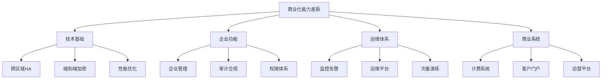

# SDKWork IM 商业化能力改进路线图

**版本**: v1.0  
**规划周期**: 12个月 (2026-07 至 2027-06)  
**目标**: 从MVP级产品进化为企业级商业化IM平台

---

## 一、商业化能力现状评估

### 1.1 能力等级评分

| 维度 | 当前评分 | 商业化要求 | 差距分析 | 优先级 |
|------|---------|-----------|---------|--------|
| **功能完整性** | 70/100 | 90/100 | 缺少企业级管理功能、审计合规、端到端加密 | 🔴 高 |
| **安全合规** | 75/100 | 95/100 | JWT签名可选、E2E加密未实现、合规认证缺失 | 🔴 高 |
| **高可用性** | 60/100 | 95/100 | 单区域部署、无跨区域容灾、灾备演练不足 | 🔴 高 |
| **性能优化** | 75/100 | 90/100 | Redis HA缺失、连接池优化不足、性能监控缺失 | 🟡 中 |
| **运维支持** | 65/100 | 85/100 | 缺少完整运维平台、监控告警不完善 | 🟡 中 |
| **商业特性** | 40/100 | 80/100 | 缺少付费功能、运营监控、客户管理门户 | 🟡 中 |

**综合评分**: 64/100 → **MVP级产品**  
**目标评分**: 90/100 → **企业级商业化产品**

### 1.2 关键差距识别



---

## 二、商业化改进三阶段路线图

### 阶段1: 基础商业化准备（3个月）

**时间**: 2026-07 至 2026-09  
**目标评分**: 75/100  
**核心目标**: 安全加固、基础HA、运维完善

#### 关键里程碑

| 里程碑 | 时间 | 交付物 | 验收标准 |
|--------|------|--------|---------|
| M1.1 安全配置加固 | 2026-07-15 | 强制JWT验证、Profile验证 | 通过安全配置检查 |
| M1.2 Redis HA部署 | 2026-07-31 | Redis Cluster部署、故障转移 | 6节点集群健康运行 |
| M1.3 运维手册v1.0 | 2026-08-15 | 完整运维文档、故障处理指南 | 覆盖所有核心场景 |
| M1.4 监控告警体系 | 2026-08-31 | Prometheus+Grafana、告警规则 | 关键指标100%覆盖 |
| M1.5 租户Quota系统 | 2026-09-15 | 配额限制、使用统计、超限告警 | 支持多维度配额 |
| M1.6 数据库优化 | 2026-09-30 | 连接池优化、读写分离验证 | P99延迟<100ms |

#### 详细任务清单

**技术基础任务**:
```yaml
security_hardening:
  - task: JWT签名验证强制启用
    effort: 2d
    priority: P0
    owner: 安全团队
    
  - task: Profile安全验证实现
    effort: 3d
    priority: P0
    owner: 后端团队
    
  - task: CI/CD安全Gate集成
    effort: 1d
    priority: P0
    owner: DevOps团队

ha_deployment:
  - task: Redis Cluster部署脚本
    effort: 3d
    priority: P0
    owner: 运维团队
    
  - task: 客户端故障转移实现
    effort: 4d
    priority: P0
    owner: 后端团队
    
  - task: 数据库连接池优化
    effort: 2d
    priority: P1
    owner: 数据库团队

tenant_isolation:
  - task: Quota模型实现
    effort: 4d
    priority: P0
    owner: 后端团队
    
  - task: Redis原子计数器
    effort: 6d
    priority: P0
    owner: 后端团队
    
  - task: 配额监控告警
    effort: 2d
    priority: P1
    owner: 运维团队
```

**运维体系任务**:
```yaml
operations:
  - task: 运维手册编写
    effort: 10d
    priority: P0
    owner: 运维团队
    deliverables:
      - 部署指南
      - 监控配置
      - 故障处理
      - 容量规划
      
  - task: 监控告警配置
    effort: 5d
    priority: P0
    owner: 运维团队
    deliverables:
      - Prometheus指标
      - Grafana仪表盘
      - 告警规则
      - 升级策略
      
  - task: 日志收集分析
    effort: 3d
    priority: P1
    owner: 运维团队
    deliverables:
      - ELK/Loki集成
      - 日志规范
      - 日志查询
```

**验收标准**:
- [ ] 安全配置检查100%通过
- [ ] Redis Cluster 6节点稳定运行
- [ ] 运维手册覆盖所有核心场景
- [ ] 监控告警覆盖率100%
- [ ] 租户Quota系统上线
- [ ] 数据库P99延迟<100ms

---

### 阶段2: 企业级能力建设（3个月）

**时间**: 2026-10 至 2026-12  
**目标评分**: 85/100  
**核心目标**: 跨区域容灾、端到端加密、企业功能完善

#### 关键里程碑

| 里程碑 | 时间 | 交付物 | 验收标准 |
|--------|------|--------|---------|
| M2.1 跨区域active-passive | 2026-10-31 | 主备区域部署、数据复制、故障切换 | RTO<30min, RPO<5min |
| M2.2 端到端加密v1.0 | 2026-11-15 | 客户端加密、密钥管理、加密消息 | 安全审计通过 |
| M2.3 企业管理功能 | 2026-11-30 | 组织管理、权限配置、策略设置 | 支持企业自助管理 |
| M2.4 审计合规系统 | 2026-12-15 | 审计日志、合规报表、数据导出 | 满足合规要求 |
| M2.5 灾备演练机制 | 2026-12-31 | 自动化演练、演练报告、预案优化 | 月度演练常态化 |

#### 详细任务清单

**高可用建设**:
```yaml
disaster_recovery:
  - task: Active-passive架构设计
    effort: 5d
    priority: P0
    owner: 架构团队
    
  - task: 数据复制机制实现
    effort: 10d
    priority: P0
    owner: 数据库团队
    components:
      - PostgreSQL流复制
      - Redis跨区域复制
      - 对象存储同步
      
  - task: 故障切换流程设计
    effort: 3d
    priority: P0
    owner: 运维团队
    
  - task: 灾备演练自动化
    effort: 5d
    priority: P1
    owner: 运维团队
    
  - task: 数据一致性验证
    effort: 4d
    priority: P0
    owner: 后端团队
```

**安全增强**:
```yaml
e2e_encryption:
  - task: 加密协议设计
    effort: 5d
    priority: P0
    owner: 安全团队
    reference: Signal Protocol
    
  - task: 客户端密钥管理
    effort: 10d
    priority: P0
    owner: 客户端团队
    components:
      - 密钥生成
      - 密钥交换
      - 密钥存储
      
  - task: 消息加密解密实现
    effort: 15d
    priority: P0
    owner: 后端团队
    components:
      - 加密算法集成
      - 消息格式定义
      - 多端同步
      
  - task: 安全审计验证
    effort: 3d
    priority: P0
    owner: 安全团队
```

**企业功能**:
```yaml
enterprise_features:
  - task: 组织管理界面
    effort: 10d
    priority: P0
    owner: 前端团队
    components:
      - 成员管理
      - 组织架构
      - 部门设置
      
  - task: 权限配置系统
    effort: 8d
    priority: P0
    owner: 后端团队
    components:
      - 角色定义
      - 权限分配
      - 权限验证
      
  - task: 消息策略配置
    effort: 5d
    priority: P1
    owner: 后端团队
    components:
      - 保留策略
      - 文件限制
      - 敏感词过滤
      
  - task: 审计日志系统
    effort: 7d
    priority: P0
    owner: 后端团队
    components:
      - 日志记录
      - 日志查询
      - 日志导出
      
  - task: 合规报表生成
    effort: 3d
    priority: P1
    owner: 后端团队
```

**验收标准**:
- [ ] 跨区域部署RTO<30min
- [ ] 端到端加密上线，安全审计通过
- [ ] 企业管理功能覆盖80%场景
- [ ] 审计日志支持查询和导出
- [ ] 灾备演练月度执行
- [ ] 数据一致性验证100%通过

---

### 阶段3: 商业化平台建设（6个月）

**时间**: 2027-01 至 2027-06  
**目标评分**: 90/100  
**核心目标**: 跨区域active-active、运营监控、客户门户、商业化系统

#### 关键里程碑

| 里程碑 | 时间 | 交付物 | 验收标准 |
|--------|------|--------|---------|
| M3.1 运营监控平台v1.0 | 2027-02-28 | 实时监控、用户分析、漏斗分析 | 覆盖核心运营指标 |
| M3.2 客户管理门户v1.0 | 2027-03-31 | 客户自助管理、使用统计、账单查看 | 客户自助完成80%操作 |
| M3.3 计费系统v1.0 | 2027-04-15 | 订阅管理、用量统计、发票生成 | 支持多计费模式 |
| M3.4 跨区域active-active | 2027-05-31 | 多区域部署、就近接入、冲突解决 | 99.99% SLA达成 |
| M3.5 合规认证准备 | 2027-06-30 | SOC 2 Type II、ISO 27001准备材料 | 认证机构评估通过 |

#### 详细任务清单

**运营平台**:
```yaml
operations_platform:
  - task: 监控指标体系设计
    effort: 5d
    priority: P0
    owner: 产品团队
    
  - task: 数据采集服务
    effort: 10d
    priority: P0
    owner: 后端团队
    components:
      - 事件埋点
      - 数据清洗
      - 数据存储
      
  - task: 可视化看板实现
    effort: 15d
    priority: P0
    owner: 前端团队
    components:
      - 实时监控
      - 用户分析
      - 漏斗分析
      - 留存分析
      
  - task: 告警规则引擎
    effort: 5d
    priority: P1
    owner: 后端团队
```

**客户门户**:
```yaml
customer_portal:
  - task: 门户架构设计
    effort: 3d
    priority: P0
    owner: 架构团队
    
  - task: 客户自助管理界面
    effort: 15d
    priority: P0
    owner: 前端团队
    components:
      - 组织管理
      - 成员管理
      - 权限配置
      - 使用统计
      
  - task: 账单查看功能
    effort: 5d
    priority: P0
    owner: 前端团队
    
  - task: 工单系统
    effort: 7d
    priority: P1
    owner: 后端团队
```

**计费系统**:
```yaml
billing_system:
  - task: 计费模型设计
    effort: 5d
    priority: P0
    owner: 产品团队
    
  - task: 订阅管理实现
    effort: 10d
    priority: P0
    owner: 后端团队
    components:
      - 套餐定义
      - 订阅创建
      - 订阅变更
      - 订阅取消
      
  - task: 用量统计系统
    effort: 8d
    priority: P0
    owner: 后端团队
    components:
      - 实时统计
      - 历史查询
      - 预测分析
      
  - task: 支付网关集成
    effort: 10d
    priority: P0
    owner: 后端团队
    components:
      - 支付渠道
      - 对账系统
      - 退款流程
      
  - task: 发票生成系统
    effort: 5d
    priority: P1
    owner: 后端团队
```

**跨区域active-active**:
```yaml
multi_region:
  - task: 多主架构设计
    effort: 10d
    priority: P0
    owner: 架构团队
    
  - task: 分布式一致性协议
    effort: 20d
    priority: P0
    owner: 后端团队
    components:
      - Raft协议实现
      - 全局序列号
      - 冲突检测
      
  - task: 就近接入实现
    effort: 5d
    priority: P0
    owner: 运维团队
    
  - task: 数据同步机制
    effort: 15d
    priority: P0
    owner: 数据库团队
    
  - task: 冲突解决策略
    effort: 10d
    priority: P0
    owner: 后端团队
```

**合规认证**:
```yaml
compliance:
  - task: SOC 2 Type II准备
    effort: 30d
    priority: P0
    owner: 合规团队
    components:
      - 安全策略文档
      - 流程文档
      - 审计证据收集
      - 控制措施验证
      
  - task: ISO 27001准备
    effort: 30d
    priority: P0
    owner: 合规团队
    components:
      - ISMS体系建设
      - 风险评估
      - 管理手册编写
      - 内审准备
      
  - task: GDPR合规评估
    effort: 10d
    priority: P1
    owner: 法务团队
    components:
      - 数据保护影响评估
      - 隐私政策更新
      - 用户权利实现
```

**验收标准**:
- [ ] 运营监控平台上线，覆盖核心指标
- [ ] 客户门户支持80%自助操作
- [ ] 计费系统支持多计费模式
- [ ] 跨区域active-active达成99.99% SLA
- [ ] SOC 2和ISO 27001认证材料准备完成
- [ ] GDPR合规评估通过

---

## 三、资源投入规划

### 3.1 团队配置

```yaml
team_structure:
  phase1:  # 3个月
    backend_engineers: 4
    frontend_engineers: 2
    devops_engineers: 2
    security_engineers: 1
    product_managers: 1
    qa_engineers: 2
    
  phase2:  # 3个月
    backend_engineers: 6
    frontend_engineers: 3
    devops_engineers: 3
    security_engineers: 2
    product_managers: 1
    qa_engineers: 3
    
  phase3:  # 6个月
    backend_engineers: 8
    frontend_engineers: 4
    devops_engineers: 3
    security_engineers: 2
    product_managers: 2
    qa_engineers: 4
    compliance_specialists: 2
```

### 3.2 预算规划

```yaml
budget_estimate:
  phase1:  # 3个月
    human_resources: $300k
    infrastructure: $30k
    tools_services: $10k
    total: $340k
    
  phase2:  # 3个月
    human_resources: $400k
    infrastructure: $50k
    tools_services: $15k
    certification: $20k
    total: $485k
    
  phase3:  # 6个月
    human_resources: $800k
    infrastructure: $100k
    tools_services: $30k
    certification: $50k
    marketing: $100k
    total: $1,080k
    
  total_investment: $1,905k
```

### 3.3 技术栈投入

```yaml
infrastructure:
  cloud_services:
    - AWS/Azure/GCP 多区域部署
    - Kubernetes集群
    - Redis Cluster
    - PostgreSQL集群
    
  monitoring:
    - Prometheus + Grafana
    - ELK/Loki日志系统
    - OpenTelemetry追踪
    
  security:
    - 密钥管理系统 (KMS)
    - 安全扫描工具
    - 渗透测试服务
    
  tools:
    - 代码仓库 (GitHub)
    - CI/CD (GitHub Actions)
    - 项目管理 (Jira)
    - 文档协作 (Confluence)
```

---

## 四、风险管理

### 4.1 技术风险

| 风险项 | 概率 | 影响 | 缓解措施 |
|--------|------|------|---------|
| 跨区域active-active实现复杂度超预期 | 中 | 高 | 提前技术预研，分阶段实施 |
| 端到端加密性能影响 | 中 | 中 | 性能基准测试，算法优化 |
| 第三方支付集成延迟 | 低 | 中 | 预留缓冲时间，备选方案 |
| 合规认证周期长 | 高 | 中 | 提前启动，并行准备材料 |

### 4.2 业务风险

| 风险项 | 概率 | 影响 | 缓解措施 |
|--------|------|------|---------|
| 市场竞争加剧 | 中 | 高 | 加快开发进度，突出差异化 |
| 客户需求变化 | 中 | 中 | 敏捷开发，快速迭代 |
| 定价策略不当 | 低 | 高 | 市场调研，A/B测试 |
| 客户获取成本高 | 中 | 中 | 多渠道推广，口碑营销 |

### 4.3 运营风险

| 风险项 | 概率 | 影响 | 缓解措施 |
|--------|------|------|---------|
| 团队人员流动 | 中 | 高 | 知识沉淀，文档完善 |
| 项目延期 | 中 | 中 | 敏捷管理，定期review |
| 质量问题 | 低 | 高 | Code review，自动化测试 |
| 安全事件 | 低 | 极高 | 安全培训，应急预案 |

---

## 五、成功指标

### 5.1 技术指标

| 指标 | Phase 1目标 | Phase 2目标 | Phase 3目标 |
|------|-----------|-----------|-----------|
| 系统可用性 | 99.5% | 99.9% | 99.99% |
| API P99延迟 | <200ms | <100ms | <50ms |
| 消息投递延迟 | <500ms | <200ms | <100ms |
| 安全配置检查通过率 | 100% | 100% | 100% |
| 自动化测试覆盖率 | 70% | 80% | 90% |
| 灾备演练频率 | 季度 | 月度 | 周度 |

### 5.2 业务指标

| 指标 | Phase 1 | Phase 2 | Phase 3 |
|------|---------|---------|---------|
| 付费客户数 | 10 | 50 | 200 |
| MRR (月经常性收入) | $10k | $50k | $200k |
| 客户满意度 (NPS) | 30 | 50 | 70 |
| 客户流失率 | <10% | <5% | <3% |
| 功能覆盖率 | 75% | 85% | 95% |
| 企业功能采纳率 | 20% | 50% | 80% |

### 5.3 产品指标

| 指标 | Phase 1 | Phase 2 | Phase 3 |
|------|---------|---------|---------|
| 功能完整性评分 | 75/100 | 85/100 | 90/100 |
| 安全合规评分 | 80/100 | 90/100 | 95/100 |
| 用户体验评分 | 70/100 | 80/100 | 85/100 |
| 文档完整性评分 | 75/100 | 85/100 | 90/100 |
| 运维成熟度评分 | 70/100 | 80/100 | 85/100 |

---

## 六、商业化策略

### 6.1 目标市场

**一级市场（重点突破）**:
- 中小企业（50-500人）
- 金融行业（券商、基金、保险）
- 医疗行业（医院、诊所）
- 教育行业（在线教育、培训）

**二级市场（机会拓展）**:
- 大型企业部门级部署
- 政府机构
- 跨国企业分支机构
- 特定垂直行业

### 6.2 定价策略

```yaml
pricing_tiers:
  starter:
    name: "初创版"
    price: $299/月
    features:
      - 最多50用户
      - 10GB存储
      - 基础功能
      - 邮件支持
    target: 小团队、初创公司
    
  professional:
    name: "专业版"
    price: $999/月
    features:
      - 最多200用户
      - 50GB存储
      - 高级功能
      - 电话支持
      - 审计日志
    target: 中小企业
    
  enterprise:
    name: "企业版"
    price: 联系销售
    features:
      - 无限用户
      - 无限存储
      - 全部功能
      - 专属支持
      - 私有化部署
      - 定制开发
    target: 大型企业、特殊行业
    
  dedicated:
    name: "专有版"
    price: 联系销售
    features:
      - 私有化部署
      - 数据隔离
      - 定制开发
      - 专属服务团队
      - SLA保障
    target: 金融、政府、医疗
```

### 6.3 销售策略

**直销策略**:
- 企业客户直销团队
- 免费试用14天
- 产品演示和POC
- 客户成功服务

**渠道策略**:
- SI合作伙伴
- 行业解决方案商
- 云市场上架（AWS Marketplace、阿里云市场）
- 技术合作伙伴

**营销策略**:
- 内容营销（技术博客、案例研究）
- 搜索引擎优化（SEO）
- 行业会议和展会
- 社区运营（开源、技术社区）

---

## 七、竞争对手分析

### 7.1 竞品对比

| 维度 | Sdkwork IM | Slack | 钉钉 | 企业微信 |
|------|-----------|-------|------|---------|
| 多租户隔离 | ✅ 强隔离 | 🟡 弱隔离 | 🟡 弱隔离 | 🟡 弱隔离 |
| 私有化部署 | ✅ 支持 | ❌ 不支持 | 🟡 部分支持 | 🟡 部分支持 |
| 端到端加密 | 🟡 开发中 | ❌ 不支持 | ❌ 不支持 | ❌ 不支持 |
| 开源可控 | ✅ 完全开源 | ❌ 闭源 | ❌ 闭源 | ❌ 闭源 |
| 定制能力 | ✅ 强 | 🟡 API限制 | 🟡 平台限制 | 🟡 平台限制 |
| 数据主权 | ✅ 完全控制 | ❌ 云端托管 | 🟡 混合 | 🟡 混合 |

### 7.2 差异化优势

**技术优势**:
1. **强多租户隔离**: 数据库层强制隔离，适合多组织场景
2. **开源可控**: 完整源代码，客户自主可控
3. **灵活部署**: 公有云、私有云、本地部署灵活选择
4. **端到端加密**: 计划实现E2EE，满足高安全需求

**商业优势**:
1. **价格优势**: 相比Slack Enterprise更经济
2. **定制能力**: 支持深度定制和二次开发
3. **数据主权**: 客户完全控制数据
4. **技术支持**: 原厂技术支持团队

---

## 八、执行监控与调整

### 8.1 月度Review机制

```yaml
monthly_review:
  participants:
    - 项目经理
    - 技术负责人
    - 产品负责人
    - 运营负责人
    
  agenda:
    - 进度回顾
    - 风险识别
    - 问题解决
    - 下月计划
    
  deliverables:
    - 月度进度报告
    - 风险评估报告
    - 调整建议
```

### 8.2 季度里程碑评审

```yaml
quarterly_review:
  participants:
    - 项目经理
    - 技术负责人
    - 产品负责人
    - 运营负责人
    - 商务负责人
    - 高管
    
  agenda:
    - 里程碑达成情况
    - 指标完成情况
    - 投入产出分析
    - 策略调整建议
    
  deliverables:
    - 季度总结报告
    - 下一季度计划
    - 资源调整申请
    - 风险应对方案
```

### 8.3 调整机制

**进度调整**:
- 进度落后10%: 增加资源投入
- 进度落后20%: 缩减范围或延期
- 进度落后30%: 重新规划里程碑

**风险应对**:
- 高风险: 立即启动应急预案，升级处理
- 中风险: 制定应对措施，密切监控
- 低风险: 记录跟踪，定期review

**资源调整**:
- 根据进度和风险动态调整团队配置
- 关键路径任务优先资源保障
- 非关键任务可适当延后或外包

---

## 九、总结与建议

### 9.1 关键成功因素

1. **技术基础扎实**: 12个月内完成从MVP到企业级的跨越
2. **团队能力匹配**: 组建具备企业级产品经验的团队
3. **资源投入充足**: 预算$1.9M，人员配置合理
4. **执行严格高效**: 月度review，季度评审，及时调整
5. **市场定位清晰**: 差异化竞争，目标市场明确

### 9.2 关键风险预警

1. **跨区域active-active技术复杂度高**: 提前预研，分阶段实施
2. **合规认证周期长**: 提前启动，并行准备材料
3. **市场竞争激烈**: 加快进度，突出差异化优势
4. **团队能力瓶颈**: 提前招聘培训，知识沉淀

### 9.3 最终建议

**立即行动**:
1. 启动Phase 1安全加固任务
2. 招聘关键岗位人员
3. 建立项目管理机制
4. 制定详细执行计划

**持续优化**:
1. 每月review进度和风险
2. 季度评审里程碑和指标
3. 根据市场反馈调整策略
4. 保持技术和产品的领先性

**商业化落地**:
1. 3个月内完成基础准备，启动试点
2. 6个月内完成企业级建设，开始销售
3. 12个月内完成商业化平台，全面推广

---

**规划制定**: SDKWork IM团队  
**批准**: 技术委员会  
**执行开始**: 2026-07-01  
**预计完成**: 2027-06-30