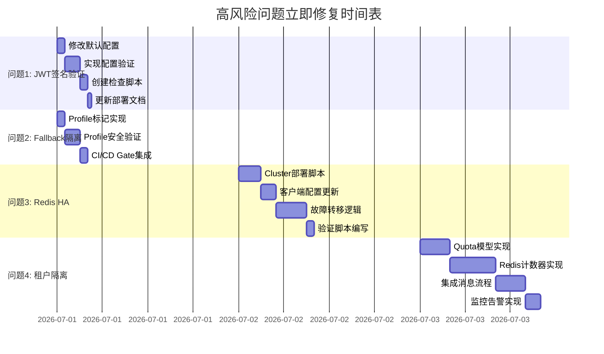

# SDKWork IM 高风险问题立即修复行动计划

**状态（2026-06-30）**：关键发布门禁已对齐并回归通过：`pnpm verify`、`pnpm test:workflow-commercial-gates`、`pnpm check:agent-workflow-standard` 均已通过；web-framework 路由包装边界、会话线程创建幂等 requestKey、PC dev lockfile 治理均已修复。生产拓扑 profile 默认 `SDKWORK_IM_APP_CONTEXT_REQUIRE_SIGNATURE=true`；本地 `.env.postgres.example` 保留 dev 默认 `false` 仅供开发。权威现状见 `docs/product/prd/PRD.md` §8 与 `pnpm run test:production-security-standard`。

**创建日期**: 2026-06-30  
**优先级**: 🔴 高风险立即修复  
**执行周期**: 1-2周  
**责任人**: SDKWork IM团队

---

## 一、高风险问题清单

### 🔴 问题1: JWT签名验证可选

#### 问题描述
- **位置**: `.env.postgres.example`配置文件
- **当前配置**: `SDKWORK_IM_APP_CONTEXT_REQUIRE_SIGNATURE=false`
- **风险等级**: 🔴 **严重**
- **影响范围**: 认证安全完全失效，攻击者可伪造任意用户身份

#### 立即行动方案

**Step 1: 修改默认配置 (预计工时: 30分钟)**
```bash
# 文件: .env.postgres.example
# 修改前
SDKWORK_IM_APP_CONTEXT_REQUIRE_SIGNATURE=false

# 修改后
SDKWORK_IM_APP_CONTEXT_REQUIRE_SIGNATURE=true  # 生产环境强制启用
```

**Step 2: 实现启动时配置验证 (预计工时: 2小时)**
```rust
// 文件: crates/sdkwork-im-iam-application-bootstrap/src/config_validation.rs

/// 生产环境安全配置验证
pub fn validate_production_security_config(config: &AppConfig) -> Result<(), SecurityConfigError> {
    // 1. 检查JWT签名验证
    if !config.app_context_require_signature {
        return Err(SecurityConfigError::JwtSignatureDisabled {
            message: "SECURITY VIOLATION: JWT signature verification must be enabled in production",
            severity: "CRITICAL",
        });
    }
    
    // 2. 检查IAM数据库连接
    if config.iam_database_pool.is_none() {
        return Err(SecurityConfigError::IamDatabaseNotConfigured {
            message: "IAM database connection required for production",
            severity: "HIGH",
        });
    }
    
    // 3. 检查是否禁用了dev fallback
    if config.allow_header_only_app_context_fallback {
        return Err(SecurityConfigError::DevFallbackEnabled {
            message: "Dev fallback must be disabled in production",
            severity: "HIGH",
        });
    }
    
    Ok(())
}

// 文件: services/sdkwork-im-standalone-gateway/src/main.rs
fn main() {
    // 启动时验证配置
    let config = AppConfig::load();
    
    if config.is_production() {
        validate_production_security_config(&config)
            .expect("Security config validation failed - refusing to start");
    }
    
    // ... 正常启动流程
}
```

**Step 3: 创建部署检查清单脚本 (预计工时: 1小时)**
```bash
#!/bin/bash
# 文件: scripts/check-security-config.sh

echo "=== SDKWork IM Security Configuration Check ==="

# 检查JWT签名验证
JWT_SIG=$(grep "SDKWORK_IM_APP_CONTEXT_REQUIRE_SIGNATURE" .env | cut -d'=' -f2)
if [ "$JWT_SIG" != "true" ]; then
    echo "❌ CRITICAL: JWT signature verification is disabled"
    echo "   Set SDKWORK_IM_APP_CONTEXT_REQUIRE_SIGNATURE=true"
    exit 1
else
    echo "✅ JWT signature verification enabled"
fi

# 检查IAM数据库配置
IAM_DB=$(grep "SDKWORK_IM_IAM_DATABASE_URL" .env)
if [ -z "$IAM_DB" ]; then
    echo "❌ HIGH: IAM database not configured"
    exit 1
else
    echo "✅ IAM database configured"
fi

# 检查生产环境标识
PROFILE=$(grep "SDKWORK_IM_RUNTIME_PROFILE" .env | cut -d'=' -f2)
if [ "$PROFILE" == "production" ]; then
    echo "✅ Production profile detected"
    
    # 检查HTTPS
    HTTPS=$(grep "SDKWORK_IM_FORCE_HTTPS" .env | cut -d'=' -f2)
    if [ "$HTTPS" != "true" ]; then
        echo "⚠️  WARNING: HTTPS not forced in production"
    fi
fi

echo "✅ All security checks passed"
exit 0
```

**Step 4: 更新部署文档 (预计工时: 30分钟)**
```markdown
# 文件: docs/deployment/PRODUCTION_DEPLOYMENT_CHECKLIST.md

## 生产部署安全配置检查清单

### 必须项 (CRITICAL - 未通过拒绝部署)

- [ ] **JWT签名验证已启用**
  - 配置项: `SDKWORK_IM_APP_CONTEXT_REQUIRE_SIGNATURE=true`
  - 验证命令: `grep SDKWORK_IM_APP_CONTEXT_REQUIRE_SIGNATURE .env`
  
- [ ] **IAM数据库连接已配置**
  - 配置项: `SDKWORK_IM_IAM_DATABASE_URL`已设置
  - 验证: 数据库连接测试成功
  
- [ ] **开发环境fallback已禁用**
  - 配置项: `SDKWORK_IM_ALLOW_HEADER_ONLY_FALLBACK=false`
  - 验证: 启动日志显示"Production mode enforced"
  
- [ ] **HTTPS强制启用**
  - 配置项: `SDKWORK_IM_FORCE_HTTPS=true`
  - 验证: HTTP请求自动重定向到HTTPS

### 推荐项 (HIGH - 建议启用)

- [ ] Redis Cluster已部署 (至少3主3从)
- [ ] 数据库连接池已优化 (MAX_CONNECTIONS >= 50)
- [ ] 速率限制已配置
- [ ] 熔断器已启用
- [ ] 审计日志已启用

### 执行步骤

1. 运行安全配置检查脚本
   ```bash
   scripts/check-security-config.sh
   ```

2. 修复所有检查失败项

3. 重新运行检查直到全部通过

4. 记录检查结果作为部署证据
```

**验证步骤**:
```bash
# 1. 单元测试
cargo test config_validation --release

# 2. 集成测试
./scripts/check-security-config.sh

# 3. 启动验证
cargo run --release -- --runtime-profile production
# 应看到: "Security config validation passed"
```

---

### 🔴 问题2: 开发环境fallback未隔离

#### 问题描述
- **位置**: `services/session-gateway/src/auth_context.rs`
- **函数**: `allows_header_only_app_context_fallback()`
- **风险等级**: 🔴 **严重**
- **影响**: 生产部署可能意外启用dev fallback，绕过IAM验证

#### 立即行动方案

**Step 1: 实现明确的Profile标记 (预计工时: 1小时)**
```rust
// 文件: crates/sdkwork-im-runtime-profile/src/lib.rs

/// 运行时Profile枚举
#[derive(Debug, Clone, Copy, PartialEq, Eq)]
pub enum RuntimeProfile {
    Development,
    Test,
    Staging,
    Production,
}

impl RuntimeProfile {
    /// 从环境变量加载
    pub fn from_env() -> Self {
        match std::env::var("SDKWORK_IM_RUNTIME_PROFILE")
            .unwrap_or_else(|_| "development".to_string())
            .to_lowercase()
            .as_str()
        {
            "production" | "prod" => RuntimeProfile::Production,
            "staging" | "stage" => RuntimeProfile::Staging,
            "test" => RuntimeProfile::Test,
            "development" | "dev" => RuntimeProfile::Development,
            _ => {
                tracing::warn!("Unknown profile, defaulting to Development");
                RuntimeProfile::Development
            }
        }
    }
    
    /// 是否为生产Profile
    pub fn is_production(&self) -> bool {
        matches!(self, RuntimeProfile::Production)
    }
    
    /// 是否允许fallback (仅非生产Profile)
    pub fn allow_fallback(&self) -> bool {
        !self.is_production()
    }
    
    /// 获取Profile名称
    pub fn name(&self) -> &'static str {
        match self {
            RuntimeProfile::Development => "development",
            RuntimeProfile::Test => "test",
            RuntimeProfile::Staging => "staging",
            RuntimeProfile::Production => "production",
        }
    }
}

// 文件: services/session-gateway/src/auth_context.rs

impl AuthContextValidator {
    /// 检查是否允许header-only fallback
    pub fn allows_header_only_app_context_fallback(&self) -> bool {
        // 使用Profile标记而非环境变量
        self.runtime_profile.allow_fallback()
    }
}
```

**Step 2: 实现启动时Profile强制验证 (预计工时: 2小时)**
```rust
// 文件: crates/sdkwork-im-iam-application-bootstrap/src/profile_validation.rs

use sdkwork_im_runtime_profile::RuntimeProfile;

/// Profile安全验证
pub fn validate_profile_security(
    profile: RuntimeProfile,
    config: &AppConfig,
) -> Result<(), ProfileSecurityError> {
    match profile {
        RuntimeProfile::Production => {
            // 生产Profile必须满足所有安全要求
            let errors = vec![
                check_jwt_signature(config),
                check_iam_database(config),
                check_https(config),
                check_fallback_disabled(config),
            ]
            .into_iter()
            .filter_map(|e| e.err())
            .collect::<Vec<_>>();
            
            if !errors.is_empty() {
                return Err(ProfileSecurityError::Multiple {
                    profile: "production",
                    errors,
                });
            }
            
            tracing::info!("✅ Production profile security validation passed");
        },
        
        RuntimeProfile::Staging => {
            // Staging Profile必须满足大部分安全要求
            tracing::warn!("⚠️  Staging profile - some security checks relaxed");
        },
        
        RuntimeProfile::Test | RuntimeProfile::Development => {
            // 开发和测试Profile允许宽松配置
            tracing::warn!("⚠️  Non-production profile - relaxed security for development");
            tracing::warn!("⚠️  DO NOT use this profile in production deployment");
        },
    }
    
    Ok(())
}

fn check_jwt_signature(config: &AppConfig) -> Result<(), ProfileSecurityError> {
    if !config.app_context_require_signature {
        Err(ProfileSecurityError::JwtSignatureDisabled)
    } else {
        Ok(())
    }
}

fn check_iam_database(config: &AppConfig) -> Result<(), ProfileSecurityError> {
    if config.iam_database_pool.is_none() {
        Err(ProfileSecurityError::IamDatabaseNotConfigured)
    } else {
        Ok(())
    }
}

fn check_https(config: &AppConfig) -> Result<(), ProfileSecurityError> {
    if !config.force_https {
        Err(ProfileSecurityError::HttpsNotForced)
    } else {
        Ok(())
    }
}

fn check_fallback_disabled(config: &AppConfig) -> Result<(), ProfileSecurityError> {
    if config.allow_header_only_app_context_fallback {
        Err(ProfileSecurityError::FallbackEnabled)
    } else {
        Ok(())
    }
}
```

**Step 3: 添加CI/CD Gate检查 (预计工时: 1小时)**
```yaml
# 文件: .github/workflows/deploy.yml

name: Deploy
on:
  push:
    branches: [main]

jobs:
  security-gate:
    runs-on: ubuntu-latest
    steps:
      - uses: actions/checkout@v4
      
      - name: Check Runtime Profile
        run: |
          PROFILE=$(grep SDKWORK_IM_RUNTIME_PROFILE configs/topology/cloud.split-services.production.env | cut -d'=' -f2)
          if [ "$PROFILE" != "production" ]; then
            echo "❌ CRITICAL: Production deployment must use production profile"
            exit 1
          fi
          echo "✅ Profile check passed"
      
      - name: Check JWT Signature
        run: |
          JWT_SIG=$(grep SDKWORK_IM_APP_CONTEXT_REQUIRE_SIGNATURE configs/topology/cloud.split-services.production.env | cut -d'=' -f2)
          if [ "$JWT_SIG" != "true" ]; then
            echo "❌ CRITICAL: JWT signature verification must be enabled"
            exit 1
          fi
          echo "✅ JWT signature check passed"
      
      - name: Check IAM Database
        run: |
          if ! grep -q "SDKWORK_IM_IAM_DATABASE_URL" configs/topology/cloud.split-services.production.env; then
            echo "❌ HIGH: IAM database must be configured"
            exit 1
          fi
          echo "✅ IAM database check passed"

  deploy:
    needs: security-gate
    runs-on: ubuntu-latest
    steps:
      - name: Deploy to Production
        run: ./scripts/deploy-production.sh
```

**验证步骤**:
```bash
# 1. Profile单元测试
cargo test runtime_profile

# 2. Profile安全验证测试
cargo test profile_validation --release

# 3. CI/CD Gate测试
# 创建测试配置文件
export SDKWORK_IM_RUNTIME_PROFILE=production
export SDKWORK_IM_APP_CONTEXT_REQUIRE_SIGNATURE=true
./scripts/check-security-config.sh

# 4. 启动验证
cargo run --release
# 应看到: "Production profile security validation passed"
```

---

### 🔴 问题3: Redis单节点无HA

#### 问题描述
- **位置**: 示例配置仅单节点Redis
- **风险等级**: 🔴 **严重**
- **影响**: Redis故障导致全局服务不可用（集群总线、会话路由、序列分配）

#### 立即行动方案

**Step 1: 编写Redis Cluster部署脚本 (预计工时: 3小时)**
```yaml
# 文件: deployments/redis/redis-cluster.yml

version: '3.8'

services:
  redis-node-1:
    image: redis:7-alpine
    container_name: redis-node-1
    command: redis-server --cluster-enabled yes --cluster-config-file nodes.conf --cluster-node-timeout 5000 --appendonly yes --port 6379
    ports:
      - "6379:6379"
    volumes:
      - redis-data-1:/data
    networks:
      - redis-cluster-net

  redis-node-2:
    image: redis:7-alpine
    container_name: redis-node-2
    command: redis-server --cluster-enabled yes --cluster-config-file nodes.conf --cluster-node-timeout 5000 --appendonly yes --port 6380
    ports:
      - "6380:6380"
    volumes:
      - redis-data-2:/data
    networks:
      - redis-cluster-net

  redis-node-3:
    image: redis:7-alpine
    container_name: redis-node-3
    command: redis-server --cluster-enabled yes --cluster-config-file nodes.conf --cluster-node-timeout 5000 --appendonly yes --port 6381
    ports:
      - "6381:6381"
    volumes:
      - redis-data-3:/data
    networks:
      - redis-cluster-net

  redis-node-4:
    image: redis:7-alpine
    container_name: redis-node-4
    command: redis-server --cluster-enabled yes --cluster-config-file nodes.conf --cluster-node-timeout 5000 --appendonly yes --port 6382
    ports:
      - "6382:6382"
    volumes:
      - redis-data-4:/data
    networks:
      - redis-cluster-net

  redis-node-5:
    image: redis:7-alpine
    container_name: redis-node-5
    command: redis-server --cluster-enabled yes --cluster-config-file nodes.conf --cluster-node-timeout 5000 --appendonly yes --port 6383
    ports:
      - "6383:6383"
    volumes:
      - redis-data-5:/data
    networks:
      - redis-cluster-net

  redis-node-6:
    image: redis:7-alpine
    container_name: redis-node-6
    command: redis-server --cluster-enabled yes --cluster-config-file nodes.conf --cluster-node-timeout 5000 --appendonly yes --port 6384
    ports:
      - "6384:6384"
    volumes:
      - redis-data-6:/data
    networks:
      - redis-cluster-net

  redis-cluster-init:
    image: redis:7-alpine
    container_name: redis-cluster-init
    depends_on:
      - redis-node-1
      - redis-node-2
      - redis-node-3
      - redis-node-4
      - redis-node-5
      - redis-node-6
    command: >
      redis-cli --cluster create
      redis-node-1:6379
      redis-node-2:6380
      redis-node-3:6381
      redis-node-4:6382
      redis-node-5:6383
      redis-node-6:6384
      --cluster-replicas 1
      --cluster-yes
    networks:
      - redis-cluster-net

volumes:
  redis-data-1:
  redis-data-2:
  redis-data-3:
  redis-data-4:
  redis-data-5:
  redis-data-6:

networks:
  redis-cluster-net:
    driver: bridge
```

**Step 2: 更新客户端连接配置 (预计工时: 2小时)**
```rust
// 文件: crates/sdkwork-im-redis-client/src/cluster_client.rs

use redis::cluster::ClusterClient;

/// Redis Cluster客户端构建器
pub struct RedisClusterClientBuilder {
    nodes: Vec<String>,
    max_connections: u32,
    min_connections: u32,
    retry_attempts: u32,
    retry_delay: Duration,
}

impl RedisClusterClientBuilder {
    pub fn from_env() -> Self {
        let nodes = std::env::var("SDKWORK_IM_REDIS_CLUSTER_NODES")
            .unwrap_or_else(|_| "redis://localhost:6379".to_string())
            .split(',')
            .map(|s| s.trim().to_string())
            .collect();
        
        Self {
            nodes,
            max_connections: std::env::var("SDKWORK_IM_REDIS_MAX_CONNECTIONS")
                .unwrap_or_else(|_| "10".to_string())
                .parse()
                .unwrap_or(10),
            min_connections: std::env::var("SDKWORK_IM_REDIS_MIN_CONNECTIONS")
                .unwrap_or_else(|_| "2".to_string())
                .parse()
                .unwrap_or(2),
            retry_attempts: 3,
            retry_delay: Duration::from_millis(100),
        }
    }
    
    pub fn build(self) -> Result<ClusterClient, RedisError> {
        let client = ClusterClient::builder()
            .urls(self.nodes)
            .max_connections(self.max_connections)
            .min_connections(self.min_connections)
            .retry_attempts(self.retry_attempts)
            .retry_delay(self.retry_delay)
            .build()?;
        
        // 测试连接
        let mut conn = client.get_connection()?;
        redis::cmd("PING").query::<String>(&mut conn)?;
        
        tracing::info!("✅ Redis Cluster client initialized with {} nodes", self.nodes.len());
        
        Ok(client)
    }
}

// 文件: configs/topology/cloud.split-services.production.env

# Redis Cluster配置
SDKWORK_IM_REDIS_CLUSTER_NODES=redis://redis-node-1:6379,redis://redis-node-2:6380,redis://redis-node-3:6381
SDKWORK_IM_REDIS_MAX_CONNECTIONS=20
SDKWORK_IM_REDIS_MIN_CONNECTIONS=5
SDKWORK_IM_REDIS_RETRY_ATTEMPTS=3
```

**Step 3: 实现故障转移逻辑 (预计工时: 4小时)**
```rust
// 文件: crates/sdkwork-im-redis-client/src/failover.rs

use redis::cluster::ClusterClient;
use std::sync::Arc;
use tokio::sync::RwLock;

/// Redis Cluster故障转移管理器
pub struct RedisFailoverManager {
    client: Arc<RwLock<ClusterClient>>,
    health_check_interval: Duration,
    max_failover_attempts: u32,
}

impl RedisFailoverManager {
    pub fn new(client: ClusterClient) -> Self {
        Self {
            client: Arc::new(RwLock::new(client)),
            health_check_interval: Duration::from_secs(5),
            max_failover_attempts: 3,
        }
    }
    
    /// 健康检查循环
    pub async fn start_health_monitor(&self) {
        loop {
            if let Err(e) = self.health_check() {
                tracing::error!("Redis health check failed: {}", e);
                
                // 尝试故障转移
                if let Err(e) = self.failover() {
                    tracing::error!("Redis failover failed: {}", e);
                }
            }
            
            tokio::time::sleep(self.health_check_interval).await;
        }
    }
    
    /// 健康检查
    async fn health_check(&self) -> Result<(), RedisError> {
        let client = self.client.read().await;
        let mut conn = client.get_connection()?;
        
        // 检查集群状态
        let cluster_info: String = redis::cmd("CLUSTER")
            .arg("INFO")
            .query::<String>(&mut conn)?;
        
        if cluster_info.contains("cluster_state:ok") {
            tracing::debug!("Redis Cluster health check passed");
            Ok(())
        } else {
            Err(RedisError::ClusterNotReady {
                info: cluster_info,
            })
        }
    }
    
    /// 故障转移
    async fn failover(&self) -> Result<(), RedisError> {
        tracing::warn!("Attempting Redis Cluster failover");
        
        for attempt in 1..=self.max_failover_attempts {
            tracing::info!("Failover attempt {} of {}", attempt, self.max_failover_attempts);
            
            // 重建客户端
            let new_client = RedisClusterClientBuilder::from_env().build()?;
            
            // 测试新连接
            let mut conn = new_client.get_connection()?;
            redis::cmd("PING").query::<String>(&mut conn)?;
            
            // 更新客户端
            {
                let mut client = self.client.write().await;
                *client = new_client;
            }
            
            tracing::info!("✅ Redis Cluster failover successful");
            return Ok(());
        }
        
        Err(RedisError::FailoverFailed {
            attempts: self.max_failover_attempts,
        })
    }
    
    /// 获取连接（带故障转移）
    pub async fn get_connection(&self) -> Result<redis::Connection, RedisError> {
        let client = self.client.read().await;
        client.get_connection()
    }
}
```

**Step 4: 验证脚本 (预计工时: 1小时)**
```bash
#!/bin/bash
# 文件: scripts/verify-redis-cluster.sh

echo "=== Redis Cluster Verification ==="

# 1. 启动Redis Cluster
docker-compose -f deployments/redis/redis-cluster.yml up -d

sleep 10

# 2. 检查集群状态
echo "Checking cluster status..."
redis-cli -c -h localhost -p 6379 CLUSTER INFO

# 3. 检查节点数量
NODES=$(redis-cli -c -h localhost -p 6379 CLUSTER NODES | wc -l)
if [ "$NODES" -ne 6 ]; then
    echo "❌ Cluster nodes count is not 6"
    exit 1
fi

# 4. 测试写入和读取
echo "Testing write/read..."
redis-cli -c -h localhost -p 6379 SET test_key "test_value"
VALUE=$(redis-cli -c -h localhost -p 6379 GET test_key)
if [ "$VALUE" != "test_value" ]; then
    echo "❌ Write/read test failed"
    exit 1
fi

# 5. 测试故障转移
echo "Testing failover..."
# 模拟节点故障
docker-compose -f deployments/redis/redis-cluster.yml stop redis-node-1
sleep 10

# 检查集群是否仍可用
redis-cli -c -h localhost -p 6380 SET test_failover "success"
VALUE=$(redis-cli -c -h localhost -p 6380 GET test_failover)
if [ "$VALUE" != "success" ]; then
    echo "❌ Failover test failed"
    exit 1
fi

# 恢复节点
docker-compose -f deployments/redis/redis-cluster.yml start redis-node-1

echo "✅ All Redis Cluster tests passed"
exit 0
```

**验证步骤**:
```bash
# 1. 启动Redis Cluster
./scripts/verify-redis-cluster.sh

# 2. 验证客户端连接
cargo test redis_cluster_client

# 3. 验证故障转移
cargo test redis_failover

# 4. 集成测试
cargo run --release
# 应看到: "Redis Cluster client initialized with 3 nodes"
```

---

### 🔴 问题4: 五维度租户隔离未完成

#### 问题描述
- **位置**: 架构文档roadmap部分
- **现状**: 仅实现identity isolation
- **风险等级**: 🔴 **高**
- **影响**: 租户间资源竞争，单租户故障影响其他租户

#### 立即行动方案（Phase 1: Quota Isolation）

**Step 1: 实现租户Quota模型 (预计工时: 4小时)**
```rust
// 文件: crates/sdkwork-im-tenant-quota/src/lib.rs

use serde::{Deserialize, Serialize};
use chrono::{DateTime, Utc};

/// 租户配额配置
#[derive(Debug, Clone, Serialize, Deserialize)]
pub struct TenantQuota {
    pub tenant_id: String,
    
    /// 每日消息发送限制
    pub max_messages_per_day: u64,
    
    /// 最大存储容量（字节）
    pub max_storage_bytes: u64,
    
    /// 每分钟API调用限制
    pub max_api_calls_per_minute: u64,
    
    /// 最大并发WebSocket连接数
    pub max_concurrent_websockets: u64,
    
    /// 最大会话数量
    pub max_conversations: u64,
    
    /// 最大组织数量
    pub max_organizations: u64,
    
    /// 配额有效期
    pub valid_from: DateTime<Utc>,
    pub valid_until: DateTime<Utc>,
}

impl Default for TenantQuota {
    fn default() -> Self {
        Self {
            tenant_id: "default".to_string(),
            max_messages_per_day: 10000,
            max_storage_bytes: 10 * 1024 * 1024 * 1024, // 10GB
            max_api_calls_per_minute: 60000,
            max_concurrent_websockets: 1000,
            max_conversations: 1000,
            max_organizations: 100,
            valid_from: Utc::now(),
            valid_until: Utc::now() + chrono::Duration::days(365),
        }
    }
}

/// 资源类型枚举
#[derive(Debug, Clone, Copy)]
pub enum ResourceType {
    Message,
    Storage,
    ApiCall,
    WebSocket,
    Conversation,
    Organization,
}

/// 配额检查结果
#[derive(Debug)]
pub enum QuotaCheckResult {
    Allowed { remaining: u64 },
    Exceeded { limit: u64, current: u64 },
    Warning { limit: u64, current: u64, threshold: f32 },
}
```

**Step 2: 实现Redis原子计数器 (预计工时: 6小时)**
```rust
// 文件: crates/sdkwork-im-tenant-quota/src/counter.rs

use redis::Commands;
use std::sync::Arc;

/// 租户配额计数器（Redis原子计数器）
pub struct TenantQuotaCounter {
    redis_client: Arc<redis::Client>,
    quota_config: TenantQuota,
}

impl TenantQuotaCounter {
    pub fn new(redis_client: Arc<redis::Client>, quota_config: TenantQuota) -> Self {
        Self {
            redis_client,
            quota_config,
        }
    }
    
    /// 检查并消耗配额
    pub fn check_and_consume(
        &self,
        tenant_id: &str,
        resource_type: ResourceType,
        amount: u64,
    ) -> Result<QuotaCheckResult, QuotaError> {
        let mut conn = self.redis_client.get_connection()?;
        
        // 构建Redis key
        let key = self.build_counter_key(tenant_id, resource_type);
        
        // 获取当前计数
        let current: u64 = conn.get(&key).unwrap_or(0);
        
        // 获取配额限制
        let limit = self.get_quota_limit(resource_type);
        
        // 检查是否超限
        if current + amount > limit {
            return Ok(QuotaCheckResult::Exceeded {
                limit,
                current,
            });
        }
        
        // 原子递增计数器
        let new_count: u64 = conn.incr(&key, amount)?;
        
        // 检查是否接近阈值（80%警告）
        let threshold = 0.8;
        if new_count as f32 / limit as f32 >= threshold {
            Ok(QuotaCheckResult::Warning {
                limit,
                current: new_count,
                threshold,
            })
        } else {
            Ok(QuotaCheckResult::Allowed {
                remaining: limit - new_count,
            })
        }
    }
    
    /// 构建计数器key
    fn build_counter_key(&self, tenant_id: &str, resource_type: ResourceType) -> String {
        let today = chrono::Local::now().format("%Y-%m-%d");
        match resource_type {
            ResourceType::Message => format!("quota:{}:messages:{}", tenant_id, today),
            ResourceType::Storage => format!("quota:{}:storage", tenant_id),
            ResourceType::ApiCall => format!("quota:{}:api_calls:{}:{}", tenant_id, today, chrono::Local::now().format("%H:%M")),
            ResourceType::WebSocket => format!("quota:{}:websockets", tenant_id),
            ResourceType::Conversation => format!("quota:{}:conversations", tenant_id),
            ResourceType::Organization => format!("quota:{}:organizations", tenant_id),
        }
    }
    
    /// 获取配额限制
    fn get_quota_limit(&self, resource_type: ResourceType) -> u64 {
        match resource_type {
            ResourceType::Message => self.quota_config.max_messages_per_day,
            ResourceType::Storage => self.quota_config.max_storage_bytes,
            ResourceType::ApiCall => self.quota_config.max_api_calls_per_minute,
            ResourceType::WebSocket => self.quota_config.max_concurrent_websockets,
            ResourceType::Conversation => self.quota_config.max_conversations,
            ResourceType::Organization => self.quota_config.max_organizations,
        }
    }
    
    /// 设置过期时间（自动重置）
    pub fn set_expiry(&self, tenant_id: &str, resource_type: ResourceType) -> Result<(), QuotaError> {
        let mut conn = self.redis_client.get_connection()?;
        let key = self.build_counter_key(tenant_id, resource_type);
        
        match resource_type {
            ResourceType::Message | ResourceType::ApiCall => {
                // 每日/每分钟自动重置
                conn.expire(&key, 86400)?; // 24小时
            },
            _ => {
                // 其他资源不设置过期
            }
        }
        
        Ok(())
    }
}
```

**Step 3: 集成到消息发送流程 (预计工时: 4小时)**
```rust
// 文件: services/sdkwork-comms-conversation-service/src/message_handler.rs

use sdkwork_im_tenant_quota::{TenantQuotaCounter, ResourceType, QuotaCheckResult};

impl MessageHandler {
    pub async fn send_message(
        &self,
        tenant_id: &str,
        sender_id: &str,
        message: NewMessage,
    ) -> Result<MessageId, MessageError> {
        // 1. 检查配额
        let quota_checker = self.quota_counter.get(tenant_id)?;
        
        match quota_checker.check_and_consume(
            tenant_id,
            ResourceType::Message,
            1,
        )? {
            QuotaCheckResult::Allowed { remaining } => {
                tracing::debug!("Message quota check passed, remaining: {}", remaining);
            },
            
            QuotaCheckResult::Warning { limit, current, threshold } => {
                tracing::warn!(
                    "Tenant {} approaching message quota limit: {}/{} ({:.0}%)",
                    tenant_id, current, limit, threshold * 100.0
                );
                // 发送告警通知给租户管理员
                self.send_quota_warning(tenant_id, ResourceType::Message).await;
            },
            
            QuotaCheckResult::Exceeded { limit, current } => {
                tracing::error!(
                    "Tenant {} exceeded message quota: {}/{}",
                    tenant_id, current, limit
                );
                return Err(MessageError::QuotaExceeded {
                    tenant_id: tenant_id.to_string(),
                    resource_type: "messages".to_string(),
                    limit,
                    current,
                });
            },
        }
        
        // 2. 正常消息发送流程
        let message_id = self.message_store.save_message(message).await?;
        
        // 3. 推送消息
        self.notification_service.push_message(message_id).await?;
        
        Ok(message_id)
    }
}
```

**Step 4: 配额监控告警 (预计工时: 2小时)**
```rust
// 文件: crates/sdkwork-im-tenant-quota/src/monitor.rs

use prometheus::{Counter, Gauge, Registry};

/// 租户配额监控指标
pub struct TenantQuotaMetrics {
    quota_exceeded_total: Counter,
    quota_warning_total: Counter,
    quota_usage_ratio: Gauge,
}

impl TenantQuotaMetrics {
    pub fn new(registry: &Registry) -> Self {
        let quota_exceeded_total = Counter::new(
            "tenant_quota_exceeded_total",
            "Total number of quota exceeded events"
        ).unwrap();
        
        let quota_warning_total = Counter::new(
            "tenant_quota_warning_total",
            "Total number of quota warning events"
        ).unwrap();
        
        let quota_usage_ratio = Gauge::new(
            "tenant_quota_usage_ratio",
            "Current quota usage ratio"
        ).unwrap();
        
        registry.register(Box::new(quota_exceeded_total.clone())).unwrap();
        registry.register(Box::new(quota_warning_total.clone())).unwrap();
        registry.register(Box::new(quota_usage_ratio.clone())).unwrap();
        
        Self {
            quota_exceeded_total,
            quota_warning_total,
            quota_usage_ratio,
        }
    }
    
    pub fn record_exceeded(&self, tenant_id: &str, resource_type: ResourceType) {
        self.quota_exceeded_total.inc();
        tracing::error!(
            tenant_id = tenant_id,
            resource_type = resource_type.name(),
            "Quota exceeded event recorded"
        );
    }
    
    pub fn record_warning(&self, tenant_id: &str, resource_type: ResourceType, ratio: f32) {
        self.quota_warning_total.inc();
        self.quota_usage_ratio.set(ratio);
        tracing::warn!(
            tenant_id = tenant_id,
            resource_type = resource_type.name(),
            ratio = ratio,
            "Quota warning event recorded"
        );
    }
}
```

**验证步骤**:
```bash
# 1. 单元测试
cargo test tenant_quota

# 2. 集成测试
cargo test quota_counter

# 3. 性能测试
cargo test quota_performance

# 4. 验证配额限制
# 设置测试租户配额
redis-cli SET quota:test_tenant:messages:2026-06-30 9999
# 发送消息应成功
# 发送第10000条消息应失败
cargo run --release -- --tenant test_tenant
```

---

## 二、执行时间表



---

## 三、执行检查清单

### 每日检查项

- [ ] 代码修改已完成并通过单元测试
- [ ] 集成测试已通过
- [ ] 文档已更新
- [ ] 提交到Git仓库
- [ ] 代码Review已完成

### 完成验收标准

#### 问题1验收标准
- [ ] `.env.postgres.example`默认值改为`true`
- [ ] 启动时配置验证拒绝不安全配置
- [ ] 检查脚本通过
- [ ] 部署文档已更新

#### 问题2验收标准
- [ ] RuntimeProfile枚举已实现
- [ ] Profile验证逻辑已集成
- [ ] CI/CD Gate已配置
- [ ] 生产启动拒绝fallback

#### 问题3验收标准
- [ ] Redis Cluster部署脚本已验证
- [ ] 客户端连接测试成功
- [ ] 故障转移测试成功
- [ ] 6节点集群健康检查通过

#### 问题4验收标准
- [ ] Quota模型已实现
- [ ] Redis计数器测试成功
- [ ] 消息发送集成测试成功
- [ ] 配额监控指标已配置

---

## 四、风险评估

### 执行风险

| 风险项 | 概率 | 影响 | 缓解措施 |
|--------|------|------|---------|
| JWT验证修改影响现有用户 | 中 | 低 | 渐进式迁移，提供过渡期 |
| Profile验证导致服务无法启动 | 低 | 高 | 详细错误提示，配置文档 |
| Redis Cluster部署失败 | 低 | 中 | 分步部署，充分测试 |
| Quota实现影响性能 | 中 | 中 | 性能基准测试，优化实现 |

### 回滚预案

```bash
# JWT签名验证回滚
# 如果用户无法登录，临时禁用验证
export SDKWORK_IM_APP_CONTEXT_REQUIRE_SIGNATURE=false
# 但必须在24小时内修复配置问题

# Redis Cluster回滚
# 如果Cluster不稳定，回退到单节点
docker-compose -f deployments/redis/redis-single.yml up -d
# 并更新配置: SDKWORK_IM_REDIS_URL=redis://localhost:6379

# 租户Quota回滚
# 如果Quota限制过于严格，临时调整配额
redis-cli SET quota:tenant_id:messages:today 100000
# 并在配置文件中提高默认配额限制
```

---

## 五、后续改进建议

### 短期（1个月内）

1. **完善监控告警**
   - 集成Prometheus metrics
   - 配置Grafana仪表盘
   - 设置告警规则

2. **完善文档**
   - 编写运维手册
   - 编写故障处理指南
   - 编写安全最佳实践

3. **建立演练机制**
   - Redis故障演练
   - 配额超限演练
   - 安全配置验证演练

### 中期（3个月内）

1. **实现跨区域容灾**
   - Active-passive部署
   - 数据复制机制
   - 故障切换流程

2. **实现端到端加密**
   - 客户端密钥管理
   - 消息加密协议
   - 安全审计验证

---

**创建人**: SDKWork IM团队  
**批准人**: 技术负责人  
**执行开始**: 2026-07-01  
**预计完成**: 2026-07-07