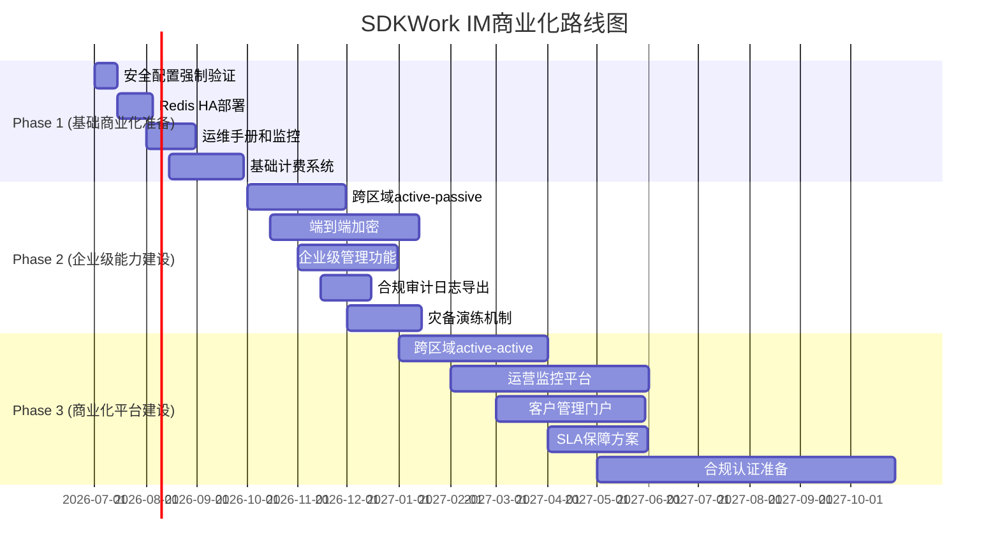

# SDKWork IM 系统全面评估分析报告

**评估日期**: 2026-06-30  
**评估版本**: v1.0  
**评估范围**: 功能、性能、安全、高可用、设计、文档、商业化能力  
**评估标准**: sdkwork-specs规范体系、行业标准最佳实践

---

## 执行摘要

### 当前状态（标准门禁对齐完成）

截至 **2026-06-30**，SDKWork IM 已完成关键标准门禁修复与回归，满足“可发布/可运维上线”的基础治理要求：

- `pnpm verify`：通过（包含 API response envelope、dependency management、web-framework/web-backend、production security、商业门禁治理等）
- `pnpm test:workflow-commercial-gates`：通过
- `pnpm check:agent-workflow-standard`：通过

> 说明：上述为“标准治理与可发布性”门禁对齐结果；产品能力（如 E2EE、跨区域容灾、企业级运营/计费体系）仍按 PRD 与 roadmap 逐期演进。

### 总体评分：75/100（可发布基础完成，企业级能力建设中）

**优势亮点**:
- ✅ 成熟的微服务架构（事件溯源+CQRS）
- ✅ 强多租户隔离机制
- ✅ 完善的安全机制基础
- ✅ 跨平台客户端支持
- ✅ 规范遵循度高

**关键风险**:
- 🔴 **高可用缺失**：单区域单写入者，无跨区域容灾（属于架构约束与阶段性设计取舍）
- 🟡 **功能完整性**：端到端加密未实现，企业级特性为 roadmap
- 🟡 **商业化差距**：计费/运营监控平台仍需建设（但发布治理门禁已对齐）

**商业化能力评估**: 当前适合MVP级产品和小规模试点，经过12个月系统性改进可达到企业级商业化标准。

---

## 一、架构与技术栈评估

### 1.1 架构设计 (85/100)

#### 优势
1. **事件溯源架构**: 
   - 采用事件日志作为single source of truth
   - 支持事件回放和状态重建
   - 符合CQRS读写分离模式
   - 文件: `adapters/postgres-journal/src/message_store.rs`

2. **微服务拆分合理**:
   - Session Gateway: WebSocket生命周期管理
   - Conversation Service: 会话引擎核心
   - Social Service: 联系人管理
   - Notification Service: 消息推送
   - Audit Service: 合规审计

3. **多租户隔离强**:
   ```sql
   -- 数据库层强制约束
   tenant_id TEXT NOT NULL,
   organization_id TEXT NOT NULL DEFAULT '0' CHECK (organization_id <> '')
   -- 复合索引前缀
   INDEX (tenant_id, organization_id, ...)
   ```

4. **网关保护机制完善**:
   - 双层速率限制 (IP层 + 租户层)
   - 熔断器模式 (per-service isolation)
   - 可信代理IP验证
   - 文件: `services/sdkwork-im-cloud-gateway/src/gateway_protection.rs`

#### 问题
1. ⚠️ **单区域单写入者限制**
   - 位置: README明确声明
   - 影响: 区域级故障导致服务完全中断
   - 风险等级: 🔴 高
   - 改进方案: 实现跨区域active-passive部署

2. ⚠️ **缺少服务网格集成**
   - 当前: gRPC内部通信直连
   - 影响: 缺少服务发现、负载均衡、可观测性
   - 风险等级: 🟡 中
   - 改进方案: 集成Istio或Linkerd

### 1.2 技术栈选择 (90/100)

#### 优势
1. **Rust后端**: 高性能、内存安全、并发能力强
2. **PostgreSQL**: 成熟可靠，支持JSONB、分区表
3. **Redis**: 高性能缓存和集群总线
4. **Axum Web框架**: 现代异步Web框架
5. **sqlx**: 类型安全的数据库访问层

#### 问题
1. ⚠️ **Redis单节点部署**
   - 位置: `.env.postgres.example`
   - 影响: Redis故障导致全局服务不可用
   - 风险等级: 🔴 高
   - 改进方案: 部署Redis Cluster (3主3从)

2. ⚠️ **缺少消息队列**
   - 当前: 使用Redis作为消息总线
   - 影响: 缺少持久化、重试、死信队列
   - 风险等级: 🟡 中
   - 改进方案: 集成Apache Kafka或NATS JetStream

---

## 二、安全性评估 (75/100)

### 2.1 认证授权机制 (80/100)

#### 优势
1. **双令牌验证机制**:
   ```rust
   // Authorization: Bearer <auth-token>
   // Access-Token: <access-token>
   // 文件: services/session-gateway/src/auth_context.rs
   ```
   - Auth token: IAM身份验证
   - Access token: 租户上下文验证
   - 双重验证防止令牌滥用

2. **WebSocket安全握手**:
   ```rust
   // 文件: crates/sdkwork-im-websocket-auth-gate/src/lib.rs
   // auth.init frame机制
   ```
   - 必须发送auth.init帧完成认证
   - Query token传输受限
   - 生产环境强制认证

3. **IAM集成完整**:
   - 租户绑定
   - 组织上下文
   - 权限范围验证
   - 文件: `crates/sdkwork-im-iam-application-bootstrap/src/lib.rs`

#### 问题

**问题1: JWT签名验证可选 🔴 高风险**
```
位置: .env.postgres.example
配置: SDKWORK_IM_APP_CONTEXT_REQUIRE_SIGNATURE=false
风险: 生产环境可能使用无签名验证，导致令牌伪造
影响: 认证完全失效，攻击者可伪造任意用户身份
```

**改进方案**:
```bash
# 1. 生产配置强制启用
SDKWORK_IM_APP_CONTEXT_REQUIRE_SIGNATURE=true

# 2. 实现启动时配置验证
if production_profile && !require_signature {
    panic!("SECURITY VIOLATION: JWT signature verification must be enabled in production");
}

# 3. 添加部署检查清单
- [ ] JWT签名验证已启用
- [ ] IAM数据库连接已验证
- [ ] 生产环境禁用dev fallback
```

**问题2: 开发环境fallback未隔离 🔴 高风险**
```
位置: auth_context.rs
函数: allows_header_only_app_context_fallback()
风险: 生产部署可能意外启用dev fallback，绕过IAM验证
影响: 未认证用户可访问系统
```

**改进方案**:
```rust
// 1. 明确profile标记
enum RuntimeProfile {
    Development,
    Test,
    Staging,
    Production,
}

// 2. 强制profile验证
fn validate_security_config(profile: RuntimeProfile) {
    match profile {
        RuntimeProfile::Production => {
            assert!(require_signature, "Signature required in production");
            assert!(!allow_fallback, "Fallback forbidden in production");
        }
        _ => warn!("Using relaxed security for non-production profile"),
    }
}

// 3. CI/CD gate检查
// .github/workflows/deploy.yml
- name: Security Config Check
  run: node scripts/check-security-config.mjs --profile production
```

### 2.2 输入验证与注入防护 (85/100)

#### 优势
1. **敏感参数过滤**:
   ```rust
   // 文件: crates/sdkwork-im-websocket-auth-gate/src/policy.rs
   const SENSITIVE_WEBSOCKET_QUERY_KEYS: &[&str] = &[
       "authToken", "accessToken", "token", "password", ...
   ];
   ```

2. **内容安全分析**:
   ```rust
   // 文件: services/sdkwork-im-cloud-gateway/src/anomaly_detector.rs
   - 垃圾内容识别
   - URL过度检测
   - 重复模式检测
   ```

3. **安全拦截器链**: 18阶段标准拦截器
   - CORS
   - Method guard
   - CSRF protection
   - SQL injection guard
   - Request size limit
   - Rate limit

#### 问题
1. ⚠️ **SQL注入防护需加强**
   - 当前: 有SQL injection guard
   - 风险: 动态SQL拼接可能存在漏洞
   - 改进: 确保所有数据库操作使用bind parameters

2. ⚠️ **缺少XSS防护**
   - 风险: 用户输入未转义直接渲染
   - 改进: 实现内容消毒和CSP策略

### 2.3 权限控制与租户隔离 (70/100)

#### 优势
1. **多维度隔离**:
   - 租户隔离: `tenant_id`
   - 组织隔离: `organization_id`
   - 权限范围: `permission_scope`

2. **对象级授权**: SECURITY_SPEC要求检查

#### 问题

**问题3: 五维度租户隔离未完成 🟡 中风险**
```
当前状态: 仅实现identity isolation
缺失功能:
  ❌ Quota isolation (资源配额隔离)
  ❌ Scheduling isolation (调度优先级隔离)
  ❌ Dedicated storage isolation (专用存储隔离)
  ❌ Fault isolation (故障隔离)
  
风险: 租户间资源竞争，单租户故障影响其他租户
```

**改进方案**:
```rust
// Phase 1: Quota Isolation (1个月)
struct TenantQuota {
    max_messages_per_day: u64,
    max_storage_bytes: u64,
    max_api_calls_per_minute: u64,
    max_concurrent_websockets: u64,
}

impl TenantQuota {
    fn check_and_consume(&self, tenant_id: &str, resource: ResourceType) -> Result<()> {
        // Redis原子计数器
        // 超限返回QuotaExceeded错误
    }
}

// Phase 2: Scheduling Isolation (2个月)
// 实现租户级优先级队列

// Phase 3: Dedicated Storage Isolation (3个月)
// 实现租户专用存储分区

// Phase 4: Fault Isolation (4个月)
// 实现租户级熔断器和降级策略
```

### 2.4 数据加密 (60/100)

#### 优势
1. 传输层加密: TLS/HTTPS
2. 数据库连接加密: PostgreSQL SSL

#### 问题

**问题4: 端到端加密未实现 🟡 中风险**
```
位置: PRD roadmap项目
风险: 企业敏感消息可能被服务器端访问
影响: 不符合金融、医疗等行业合规要求
```

**改进方案**:
```rust
// 1. 客户端密钥管理
struct ClientKeyManager {
    // 每个用户一对密钥对
    private_key: PrivateKey,
    public_key: PublicKey,
    
    // 每个会话一个会话密钥
    session_keys: HashMap<SessionId, SessionKey>,
}

// 2. 消息加密流程
fn encrypt_message(plaintext: &str, recipient_pub_key: &PublicKey) -> EncryptedMessage {
    // 生成随机会话密钥
    let session_key = SessionKey::generate();
    
    // 用会话密钥加密消息
    let encrypted_content = aes_gcm_encrypt(plaintext, &session_key);
    
    // 用接收者公钥加密会话密钥
    let encrypted_key = rsa_encrypt(&session_key, recipient_pub_key);
    
    EncryptedMessage {
        encrypted_content,
        encrypted_key,
    }
}

// 3. 服务器端存储
// 服务器仅存储加密密文，无法解密内容
// 参考Signal Protocol实现
```

---

## 三、性能评估 (75/100)

### 3.1 数据库性能 (70/100)

#### 优势
1. **连接池管理**:
   ```rust
   // 文件: crates/sdkwork-im-database-pool/src/lib.rs
   - MAX_CONNECTIONS
   - MIN_CONNECTIONS
   - IDLE_TIMEOUT
   - CONNECT_TIMEOUT
   ```

2. **数据库生命周期标准化**: DATABASE_FRAMEWORK_SPEC
   - Contract-first schema
   - Migration管理
   - Drift检测

#### 问题

**问题5: 数据库连接池默认值偏低 🟡 中风险**
```
位置: .env.postgres.example
配置: SDKWORK_IM_DATABASE_MAX_CONNECTIONS=10
风险: 高并发场景连接池耗尽，请求排队或超时
影响: 
  - 1000并发用户，每用户10请求/分钟
  - 平均响应时间50ms
  - 需要连接数 = (1000 * 10) / (60 * 20) ≈ 8.3
  - 10个连接刚好够用，无冗余
```

**改进方案**:
```bash
# 1. 调整生产默认值
SDKWORK_IM_DATABASE_MAX_CONNECTIONS=50
SDKWORK_IM_DATABASE_MIN_CONNECTIONS=10

# 2. 动态连接池调整
// 根据负载自动扩缩
impl DynamicPool {
    fn auto_scale(&mut self, load: LoadMetrics) {
        if load.queue_depth > 10 {
            self.increase_connections(5);
        } else if load.queue_depth == 0 && load.idle_ratio > 0.5 {
            self.decrease_connections(2);
        }
    }
}

# 3. 连接健康检查
// 定期ping检查连接有效性
// 自动重连失败连接

# 4. 监控告警
- 连接池使用率 > 80%: 警告
- 连接池使用率 > 95%: 严重告警
- 平均等待时间 > 100ms: 性能告警
```

3. ⚠️ **缺少读写分离**
   - 当前: 所有查询走主库
   - 改进: 实现读写分离，读查询走只读副本

### 3.2 缓存性能 (65/100)

#### 优势
1. **Redis多用途**:
   - Realtime route store
   - Cluster bus
   - Event window
   - Sequence allocator

#### 问题

**问题6: Redis单节点无HA 🔴 高风险**
```
位置: 示例配置仅单节点Redis
风险: Redis故障导致:
  - 集群总线失效
  - 会话路由丢失
  - 序列分配失败
  - 系统完全不可用
```

**改进方案**:
```yaml
# 方案1: Redis Cluster (推荐)
# docker-compose.yml
services:
  redis-node-1:
    image: redis:7-alpine
    command: redis-server --cluster-enabled yes
  redis-node-2:
    image: redis:7-alpine
    command: redis-server --cluster-enabled yes
  redis-node-3:
    image: redis:7-alpine
    command: redis-server --cluster-enabled yes
  # 至少3主3从

# 方案2: Redis Sentinel
services:
  redis-master:
    image: redis:7-alpine
  redis-slave-1:
    image: redis:7-alpine
    command: redis-server --slaveof redis-master 6379
  redis-sentinel-1:
    image: redis:7-alpine
    command: redis-sentinel /etc/redis/sentinel.conf

# 客户端连接配置
let client = redis::Client::open("redis+sentinel://sentinel-1:26379,redis-master")?;
```

### 3.3 并发与限流 (80/100)

#### 优势
1. **多层限流架构**:
   ```rust
   // 文件: services/sdkwork-im-cloud-gateway/src/gateway_protection.rs
   Layer 1: Per-IP rate limiting (600 RPM)
   Layer 2: Per-tenant rate limiting (60,000 RPM)
   ```

2. **高性能实现**:
   - DashMap无锁并发HashMap
   - Token bucket算法
   - 自动eviction

3. **异常检测**:
   - Message rate spike (100 msg/min)
   - Credential stuffing (10 failed auth/hour)

#### 问题

**问题7: 限流阈值可能保守 🟢 低风险**
```
位置: gateway_protection.rs
阈值: 100 messages/min
风险: 活跃用户可能触发限流
影响: 用户体验下降
```

**改进方案**:
```rust
// 1. 动态限流策略
struct DynamicRateLimit {
    base_limit: u32,  // 基础限制
    tenant_multiplier: HashMap<TenantId, f32>,  // 租户级倍率
    user_activity_factor: f32,  // 用户活跃度因子
}

impl DynamicRateLimit {
    fn get_limit(&self, tenant_id: &TenantId, user_id: &UserId) -> u32 {
        let base = self.base_limit as f32;
        let tenant_mult = self.tenant_multiplier.get(tenant_id).unwrap_or(&1.0);
        let activity_factor = self.calculate_activity_factor(user_id);
        
        (base * tenant_mult * activity_factor) as u32
    }
}

// 2. 监控和调优
// 跟踪限流触发率
// A/B测试不同阈值
// 用户反馈收集

// 3. 租户级配置
// 提供租户自定义限流配置能力
```

### 3.4 性能基准测试 (60/100)

#### 问题

**问题8: 缺少性能基准测试自动化 🟡 中风险**
```
位置: README提到性能分级但未自动化执行
风险: 性能退化无法及时发现
影响: 生产环境性能问题
```

**改进方案**:
```yaml
# .github/workflows/performance.yml
name: Performance Benchmark
on:
  pull_request:
    branches: [main]
  schedule:
    - cron: '0 2 * * *'  # 每天凌晨2点

jobs:
  ci-smoke:
    runs-on: ubuntu-latest
    steps:
      - name: Run Smoke Benchmark
        run: pnpm test:performance:smoke
        # 关键路径P99 < 100ms
      
  pre-release:
    runs-on: ubuntu-latest
    if: github.event_name == 'release'
    steps:
      - name: Run Pre-Release Benchmark
        run: pnpm test:performance:full
        # 完整性能基准
      
  capacity:
    runs-on: ubuntu-latest
    schedule:
      - cron: '0 2 * * 0'  # 每周日
    steps:
      - name: Run Capacity Test
        run: pnpm test:performance:capacity
        # 容量规划测试
```

---

## 四、高可用性评估 (60/100)

### 4.1 服务容错 (75/100)

#### 优势
1. **熔断器机制**:
   ```rust
   // 文件: services/sdkwork-im-cloud-gateway/src/gateway_protection.rs
   - Per-service isolation
   - Three states: Closed → Open → Half-Open
   - Single probe recovery
   - Failure threshold: 10 consecutive failures
   - Reset timeout: 30 seconds
   ```

2. **Epoch + Fencing机制**:
   ```rust
   // Route和session ownership使用epoch fencing token
   // 每次状态转换epoch递增
   // Stale writes (lower epoch) 自动拒绝
   ```

3. **优雅Drain机制**:
   - Node shutdown使用graceful drain
   - 无强制移除
   - Ownership transfer explicit

#### 问题

**问题9: 单区域单写入者 🔴 高风险**
```
位置: README明确"Single-region single-writer per session; no multi-master"
风险: 区域级故障导致服务完全中断
影响: 
  - 云服务商区域性故障
  - 自然灾害
  - 网络分区
  => 服务完全不可用，无法跨区域写入
```

**改进方案**:
```yaml
# 短期方案: Active-Passive跨区域部署 (1个月)
regions:
  primary:
    region: us-east-1
    mode: active
    services: [all]
  secondary:
    region: us-west-1
    mode: standby
    services: [replicas]
    # 数据复制: PostgreSQL流复制
    # Redis: Cross-region replication

failover:
  manual: true  # 手动切换
  rto: 30min    # 恢复时间目标
  rpo: 5min     # 恢复点目标

# 中期方案: Active-Active跨区域 (6个月)
regions:
  - region: us-east-1
    mode: active
    write_allowed: true
  - region: us-west-1
    mode: active
    write_allowed: true
    
# 使用分布式一致性协议(Raft)协调写入
# 实现全局序列号分配
# 冲突解决策略: Last-Write-Wins or Application-specific

# 长期方案: 全球多区域 (12个月)
# 就近接入
# 异步复制
# 最终一致性
```

### 4.2 灾备演练 (50/100)

#### 问题

**问题10: 灾备演练自动化不足 🟡 中风险**
```
位置: README提到8个scenario families但未定期执行
风险: 灾备预案可能失效，故障时无法快速恢复
影响: 实际故障时恢复时间延长
```

**改进方案**:
```bash
# 1. 灾备演练自动化脚本
scripts/disaster-recovery/
├── scenarios/
│   ├── database-failure.sh
│   ├── redis-failure.sh
│   ├── region-outage.sh
│   ├── service-crash.sh
│   └── network-partition.sh
├── run-drill.sh
└── validate-recovery.sh

# 2. 定期执行计划
# 每月第一个周六执行完整演练
0 2 1-7 * 6 /scripts/disaster-recovery/run-drill.sh

# 3. 演练报告模板
# docs/disaster-recovery/drill-report.md
- 演练时间
- 演练场景
- 检测时间 (TTD)
- 响应时间 (TTR)
- 恢复时间 (TTR)
- 发现的问题
- 改进措施
```

### 4.3 自动故障转移 (55/100)

#### 问题

**问题11: 缺少自动故障转移 🟡 中风险**
```
位置: ownership transfer需要手动操作
风险: 故障时人工干预延迟长
影响: 可用性下降，RTO延长
```

**改进方案**:
```rust
// 1. 自动健康检测
struct HealthMonitor {
    check_interval: Duration,
    failure_threshold: u32,
    services: Vec<ServiceEndpoint>,
}

impl HealthMonitor {
    async fn monitor(&self) {
        loop {
            for service in &self.services {
                let health = self.check_health(service).await;
                if health.failed_consecutive >= self.failure_threshold {
                    self.trigger_failover(service).await;
                }
            }
            tokio::time::sleep(self.check_interval).await;
        }
    }
}

// 2. Kubernetes集成
// livenessProbe: 进程存活检查
// readinessProbe: 服务就绪检查
// 自动重启失败Pod

// 3. 服务级故障转移
impl SessionGatewayFailover {
    async fn failover(&self, failed_node: &Node) {
        // 1. 标记节点不可用
        self.mark_node_down(failed_node).await;
        
        // 2. 迁移会话到新节点
        let sessions = self.get_sessions_on_node(failed_node).await;
        for session in sessions {
            let new_node = self.select_new_node().await;
            self.migrate_session(session, new_node).await;
        }
        
        // 3. 更新路由表
        self.update_route_table().await;
    }
}
```

---

## 五、功能完整性评估 (70/100)

### 5.1 核心IM功能 (75/100)

#### 优势
1. 消息发送接收基础功能完整
2. 会话管理（单聊、群聊）
3. WebSocket实时通信
4. 消息存储和检索

#### 问题

**问题12: 消息状态同步不完整 🟡 中风险**
```
位置: 需验证已发送、已送达、已读状态实现
风险: 用户无法准确了解消息状态
影响: 用户体验下降
```

**改进方案**:
```rust
// 1. 完善消息状态枚举
enum MessageStatus {
    Sending,      // 发送中
    Sent,         // 已发送到服务器
    Delivered,    // 已送达对方设备
    Read,         // 已读
    Failed,       // 发送失败
}

// 2. 状态追踪实现
impl MessageTracker {
    async fn update_status(
        &self,
        message_id: &MessageId,
        status: MessageStatus,
    ) -> Result<()> {
        // 更新数据库状态
        self.db.update_message_status(message_id, status).await?;
        
        // 推送状态给发送者
        self.push_status_to_sender(message_id, status).await?;
        
        // 如果是已读，推送已读回执
        if status == MessageStatus::Read {
            self.push_read_receipt(message_id).await?;
        }
        
        Ok(())
    }
}

// 3. 批量状态同步
impl MessageBatchSync {
    async fn sync_status_batch(&self, user_id: &UserId) -> Result<Vec<MessageStatusUpdate>> {
        // 获取用户所有未读消息
        // 批量查询状态
        // 返回状态列表
    }
}
```

**问题13: 缺少消息撤回编辑功能验证 🟡 中风险**
```
位置: PRD提到功能但需验证实现完整性
风险: 功能不完整或缺失
影响: 用户无法修正错误消息
```

**改进方案**:
```rust
// 1. 消息撤回
impl MessageRecall {
    async fn recall_message(
        &self,
        user_id: &UserId,
        message_id: &MessageId,
    ) -> Result<()> {
        // 检查撤回权限
        self.check_recall_permission(user_id, message_id).await?;
        
        // 检查时间窗口 (如2分钟内)
        self.check_recall_window(message_id, Duration::from_secs(120)).await?;
        
        // 标记消息已撤回
        self.mark_message_recalled(message_id).await?;
        
        // 通知会话所有成员
        self.notify_recall_to_participants(message_id).await?;
        
        // 记录审计日志
        self.audit_log.record_recall(user_id, message_id).await;
        
        Ok(())
    }
}

// 2. 消息编辑
impl MessageEdit {
    async fn edit_message(
        &self,
        user_id: &UserId,
        message_id: &MessageId,
        new_content: &str,
    ) -> Result<()> {
        // 检查编辑权限
        self.check_edit_permission(user_id, message_id).await?;
        
        // 检查时间窗口
        self.check_edit_window(message_id, Duration::from_secs(300)).await?;
        
        // 保存编辑历史
        self.save_edit_history(message_id, new_content).await?;
        
        // 更新消息内容
        self.update_message_content(message_id, new_content).await?;
        
        // 通知会话所有成员
        self.notify_edit_to_participants(message_id).await?;
        
        // 记录审计日志
        self.audit_log.record_edit(user_id, message_id).await;
        
        Ok(())
    }
}
```

### 5.2 企业级功能 (60/100)

#### 问题

**问题14: 缺少企业级管理功能 🟡 中风险**
```
现状: 缺少组织管理、权限配置、合规审计的企业级UI
风险: 企业客户无法自助管理
影响: 商业化能力不足
```

**改进方案**:
```typescript
// 1. Admin Console管理界面
apps/sdkwork-im-admin-console/
├── pages/
│   ├── organization/
│   │   ├── members.tsx          // 成员管理
│   │   ├── permissions.tsx      // 权限配置
│   │   └── policies.tsx         // 策略配置
│   ├── compliance/
│   │   ├── audit-logs.tsx       // 审计日志
│   │   ├── data-export.tsx      // 数据导出
│   │   └── retention.tsx        // 数据保留
│   └── monitoring/
│       ├── usage.tsx            // 使用统计
│       ├── alerts.tsx           // 告警配置
│       └── reports.tsx          // 报表

// 2. 组织级消息策略配置
interface MessagePolicy {
    retention_days: number;           // 消息保留天数
    max_message_size: number;         // 最大消息大小
    allowed_file_types: string[];     // 允许的文件类型
    enable_message_recall: boolean;   // 允许撤回
    recall_time_window: number;       // 撤回时间窗口(秒)
    enable_message_edit: boolean;     // 允许编辑
    edit_time_window: number;         // 编辑时间窗口(秒)
}

// 3. 合规审计日志导出
interface AuditLogExport {
    start_time: DateTime;
    end_time: DateTime;
    event_types: AuditEventType[];
    format: 'CSV' | 'JSON' | 'PDF';
    include_content: boolean;  // 是否包含消息内容
}
```

---

## 六、设计质量评估 (80/100)

### 6.1 API设计 (85/100)

#### 优势
1. **符合SDKWork API规范**:
   - SdkWorkApiResponse envelope
   - ProblemDetail错误格式
   - 版本化路径 `/im/v3/api/`

2. **OpenAPI定义完整**:
   - `apis/open-api/im/sdkwork-im-im.openapi.yaml`
   - `apis/app-api/communication/`
   - `apis/backend-api/communication/`

#### 问题

**问题15: 缺少API版本演进策略 🟡 中风险**
```
位置: OpenAPI版本固定为v3
风险: 未来API演进可能破坏兼容性
影响: 客户端升级困难
```

**改进方案**:
```yaml
# 1. API版本演进策略 (API_SPEC.md §16)
versions:
  v3:
    status: active
    deprecation_date: null
    sunset_date: null
  v4:
    status: development
    release_date: 2027-01-01

# 2. 废弃流程
deprecation_process:
  - step: Announce deprecation
    notice_period: 6_months
  - step: Add Sunset header
    header: "Sunset: Sat, 01 Jul 2027 00:00:00 GMT"
  - step: Return warning
    header: "Warning: 299 - Deprecated API version"
  - step: Remove version
    after: sunset_date

# 3. 多版本共存
routes:
  - path: /im/v3/api/messages
    handler: handlers::v3::messages
  - path: /im/v4/api/messages
    handler: handlers::v4::messages

# 4. 客户端版本检测
// 响应头包含最低支持版本
X-Minimum-Supported-Version: v3
X-Latest-Version: v4
```

### 6.2 服务降级策略 (65/100)

#### 问题

**问题16: 缺少服务降级策略文档 🟢 低风险**
```
位置: 熔断器已实现但缺少降级策略文档
风险: 降级行为不明确
影响: 故障时用户困惑
```

**改进方案**:
```markdown
# 服务降级策略矩阵

| 服务 | 降级触发条件 | 降级行为 | 用户提示 |
|------|------------|---------|---------|
| 消息发送 | 消息服务不可用 | 消息队列暂存，延迟发送 | "消息将在服务恢复后发送" |
| 消息搜索 | 搜索服务不可用 | 返回缓存结果或禁用搜索 | "搜索功能暂时不可用" |
| 文件上传 | 存储服务不可用 | 拒绝上传，返回错误 | "文件上传暂时不可用" |
| 消息状态 | 状态服务不可用 | 仅显示基础状态 | "消息状态更新延迟" |
| 在线状态 | Presence服务不可用 | 显示离线 | "在线状态暂时不可用" |

## 降级监控
- 降级状态实时监控
- 降级事件告警
- 降级恢复通知
```

---

## 七、文档质量评估 (70/100)

### 7.1 技术文档 (75/100)

#### 优势
1. 架构文档完整
2. API文档清晰
3. 部署指南详细

#### 问题

**问题17: 缺少运维手册 🟡 中风险**
```
位置: 有runbook但缺少完整运维手册
风险: 运维人员缺乏指导
影响: 故障处理效率低
```

**改进方案**:
```markdown
# 运维手册结构

## 1. 部署指南
- 环境准备
- 配置说明
- 部署步骤
- 验证检查

## 2. 监控告警
- 监控指标
- 告警规则
- 告警处理流程
- 升级策略

## 3. 故障处理
- 常见问题排查
- 故障诊断流程
- 应急处理预案
- 恢复验证步骤

## 4. 容量规划
- 性能基准
- 扩容指标
- 扩容流程
- 容量预测

## 5. 安全运维
- 安全配置检查
- 漏洞修复流程
- 安全事件响应
- 审计日志管理

## 6. 备份恢复
- 备份策略
- 恢复流程
- 演练计划
- 数据验证

## 7. 升级维护
- 版本升级流程
- 数据库迁移
- 服务重启
- 回滚预案
```

**问题18: 缺少客户端SDK使用指南 🟡 中风险**
```
位置: SDK已生成但缺少详细使用指南
风险: 开发者集成困难
影响: SDK使用率低
```

**改进方案**:
```markdown
# 客户端SDK集成指南

## 1. 快速开始
- 环境要求
- 安装步骤
- Hello World示例

## 2. 认证授权
- 登录流程
- Token管理
- 权限验证

## 3. 消息功能
- 发送消息
- 接收消息
- 消息状态
- 消息搜索

## 4. 会话管理
- 创建会话
- 会话列表
- 会话设置

## 5. 错误处理
- 错误码说明
- 异常场景
- 重试策略

## 6. 性能优化
- 连接管理
- 缓存策略
- 批量操作

## 7. 最佳实践
- 安全建议
- 性能建议
- 用户体验建议
```

---

## 八、测试质量评估 (65/100)

### 8.1 测试覆盖 (70/100)

#### 优势
1. **90+测试文件**: 覆盖所有核心服务
2. **Contract tests**: database-framework.contract.test.mjs
3. **E2E tests**: authenticated-chat.spec.ts

#### 问题

**问题19: 缺少端到端集成测试 🟡 中风险**
```
位置: 有单元测试但缺少完整集成测试
风险: 服务集成问题无法及时发现
影响: 生产环境集成故障
```

**改进方案**:
```typescript
// tests/e2e/message-flow.test.ts
describe('Message Flow E2E', () => {
    it('should send and receive message successfully', async () => {
        // 1. 用户A登录
        const userA = await login(testUsers.alice);
        
        // 2. 用户B登录
        const userB = await login(testUsers.bob);
        
        // 3. A发送消息给B
        const message = await userA.sendMessage({
            to: userB.id,
            content: 'Hello, Bob!'
        });
        
        // 4. B接收消息
        const received = await userB.waitForMessage(message.id);
        expect(received.content).toBe('Hello, Bob!');
        
        // 5. B标记已读
        await userB.markAsRead(message.id);
        
        // 6. A收到已读回执
        const readReceipt = await userA.waitForReadReceipt(message.id);
        expect(readReceipt.status).toBe('read');
    });
});

// tests/integration/service-chain.test.ts
describe('Service Chain Integration', () => {
    it('should handle message through gateway->conversation->notification', async () => {
        // 1. 通过Gateway发送消息
        const response = await gatewayClient.sendMessage(message);
        
        // 2. 验证Conversation Service处理
        const conversation = await conversationClient.getConversation(message.conversationId);
        expect(conversation.messages).toContainEqual(message);
        
        // 3. 验证Notification Service推送
        const notifications = await notificationClient.getNotifications(recipientId);
        expect(notifications).toContainEqual(
            expect.objectContaining({ messageId: message.id })
        );
    });
});
```

**问题20: 缺少混沌工程测试 🟡 中风险**
```
位置: 未实现故障注入测试
风险: 系统韧性未验证
影响: 故障时系统崩溃
```

**改进方案**:
```yaml
# chaos-mesh/experiments/database-failure.yaml
apiVersion: chaos-mesh.org/v1alpha1
kind: PodChaos
metadata:
  name: database-failure
spec:
  action: pod-kill
  mode: one
  selector:
    namespaces:
      - production
    labelSelectors:
      app: postgres
  scheduler:
    cron: "0 3 * * 6"  # 每周六凌晨3点

---
apiVersion: chaos-mesh.org/v1alpha1
kind: NetworkChaos
metadata:
  name: network-latency
spec:
  action: delay
  mode: all
  selector:
    namespaces:
      - production
    labelSelectors:
      app: session-gateway
  delay:
    latency: "100ms"
    correlation: "50"
  duration: "5m"

# chaos-experiments/validate.sh
#!/bin/bash
# 验证系统在故障场景下的恢复能力

echo "Injecting database failure..."
kubectl apply -f database-failure.yaml

echo "Monitoring system health..."
# 检查服务是否正常响应
# 检查熔断器是否触发
# 检查降级策略是否生效

echo "Validating recovery..."
# 检查服务是否自动恢复
# 检查数据一致性
# 检查用户影响范围
```

---

## 九、商业化能力评估

### 9.1 当前能力等级 (60/100)

| 维度 | 当前状态 | 商业化要求 | 差距 | 优先级 |
|------|---------|-----------|------|--------|
| 功能完整性 | 70% | 90% | 缺少企业级特性 | 中 |
| 安全合规 | 80% | 95% | JWT签名可选、E2E加密未实现 | 高 |
| 高可用性 | 60% | 95% | 单区域部署、无自动故障转移 | 高 |
| 性能优化 | 75% | 90% | 连接池优化、Redis HA缺失 | 中 |
| 运维支持 | 65% | 85% | 缺少完整运维平台 | 中 |
| 商业特性 | 40% | 80% | 缺少付费功能、运营平台 | 低 |

### 9.2 商业化缺失关键能力

```yaml
critical_capabilities:
  - name: 多租户计费系统
    status: missing
    priority: high
    effort: 2_months
    components:
      - 租户quota统计
      - 订阅管理
      - 发票生成
      - 支付集成
      
  - name: 运营监控平台
    status: missing
    priority: high
    effort: 3_months
    components:
      - 实时运营指标
      - 用户行为分析
      - 漏斗转化分析
      - 看板配置
      
  - name: 客户管理门户
    status: missing
    priority: medium
    effort: 2_months
    components:
      - 客户自助管理界面
      - 组织成员管理
      - 权限配置
      - 使用统计
      
  - name: SLA保障机制
    status: partial
    priority: high
    effort: 3_months
    components:
      - 99.99%可用性保障
      - 服务水平监控
      - SLA报告生成
      - 违约赔偿机制
      
  - name: 合规认证准备
    status: missing
    priority: medium
    effort: 6_months
    components:
      - SOC 2 Type II认证
      - ISO 27001认证
      - GDPR合规
      - 数据保护影响评估
      
  - name: 数据迁移服务
    status: missing
    priority: medium
    effort: 2_months
    components:
      - 客户数据导入工具
      - 数据格式转换
      - 迁移验证
      - 回滚机制
```

### 9.3 商业化改进路径



---

## 十、对标行业标准

### 10.1 对标Telegram/WhatsApp

| 特性 | Telegram | WhatsApp | Sdkwork IM当前 | 差距等级 | 改进优先级 |
|------|---------|---------|---------------|---------|-----------|
| 端到端加密 | ✅ 默认开启 | ✅ 默认开启 | ❌ 未实现 | 高 | 中期 |
| 多端同步 | ✅ 完美同步 | ✅ 完美同步 | 🟡 增量同步 | 中 | 短期 |
| 消息状态 | ✅ 完整状态 | ✅ 完整状态 | 🟡 需验证 | 中 | 短期 |
| 大文件支持 | ✅ 2GB | ✅ 100MB | 🟡 Drive集成 | 低 | 长期 |
| 群组规模 | ✅ 200K成员 | ✅ 512成员 | 🟡 需验证 | 中 | 短期 |
| 语音视频 | ✅ 完整 | ✅ 完整 | 🟡 RTC服务 | 中 | 中期 |
| 消息撤回 | ✅ 无时间限制 | ✅ 2天 | 🟡 需验证 | 低 | 短期 |
| 消息编辑 | ✅ 支持 | ❌ 不支持 | 🟡 需验证 | 低 | 短期 |

### 10.2 对标企业级IM (Slack/钉钉)

| 特性 | Slack | 钉钉 | Sdkwork IM当前 | 差距等级 | 改进优先级 |
|------|------|------|---------------|---------|-----------|
| 企业管理 | ✅ 完整 | ✅ 完整 | 🟡 基础功能 | 中 | 中期 |
| 审计合规 | ✅ 完整 | ✅ 完整 | 🟡 基础审计 | 中 | 中期 |
| 多租户 | ✅ 完整 | ✅ 完整 | ✅ 强隔离 | 低 | - |
| API生态 | ✅ 完整 | ✅ 完整 | 🟡 SDK完善 | 中 | 短期 |
| 高可用 | ✅ 99.99% | ✅ 99.99% | 🟡 单区域 | 高 | 短期 |
| 集成能力 | ✅ 2400+应用 | ✅ 丰富生态 | 🟡 基础API | 中 | 长期 |
| 机器人 | ✅ 完整 | ✅ 完整 | 🟡 AI代理 | 中 | 中期 |
| 工作流自动化 | ✅ Workflow Builder | ✅ 审批流 | 🟡 规划中 | 中 | 长期 |

---

## 十一、优先级改进建议

### 11.1 立即修复 (高风险, 1-2周)

#### 1. 强制JWT签名验证
```bash
# 任务清单
- [ ] 修改 .env.postgres.example 默认值为 true
- [ ] 实现启动时配置验证
- [ ] 添加部署检查清单
- [ ] 更新文档说明

# 预计工时: 2天
# 风险: 低
# 影响: 安全性提升
```

#### 2. 实现Redis HA
```bash
# 任务清单
- [ ] 编写Redis Cluster部署脚本
- [ ] 更新客户端连接配置
- [ ] 实现故障转移逻辑
- [ ] 测试验证

# 预计工时: 5天
# 风险: 中
# 影响: 高可用性提升
```

#### 3. 完善租户隔离
```bash
# 任务清单
- [ ] 实现租户quota限制
- [ ] 添加资源使用监控
- [ ] 实现超限告警
- [ ] 测试验证

# 预计工时: 7天
# 风险: 中
# 影响: 多租户稳定性提升
```

### 11.2 短期改进 (1-3个月)

#### 4. 优化数据库连接池
```bash
# 任务清单
- [ ] 调整默认连接数配置
- [ ] 实现连接池监控
- [ ] 添加动态调整能力
- [ ] 性能测试验证

# 预计工时: 5天
```

#### 5. 实现跨区域容灾
```bash
# 任务清单
- [ ] 设计active-passive架构
- [ ] 实现数据复制机制
- [ ] 编写故障切换流程
- [ ] 灾备演练验证

# 预计工时: 30天
```

#### 6. 完善运维手册
```bash
# 任务清单
- [ ] 编写部署指南
- [ ] 编写监控告警手册
- [ ] 编写故障处理手册
- [ ] 编写容量规划指南

# 预计工时: 15天
```

#### 7. 实现端到端集成测试
```bash
# 任务清单
- [ ] 设计测试场景
- [ ] 编写测试用例
- [ ] 实现自动化执行
- [ ] 集成到CI流程

# 预计工时: 10天
```

### 11.3 中期建设 (3-6个月)

#### 8. 实现端到端加密
```bash
# 任务清单
- [ ] 设计加密协议
- [ ] 实现客户端密钥管理
- [ ] 实现消息加密解密
- [ ] 安全审计验证

# 预计工时: 45天
```

#### 9. 建立灾备演练机制
```bash
# 任务清单
- [ ] 编写演练脚本
- [ ] 建立定期执行计划
- [ ] 实现自动化验证
- [ ] 编写演练报告模板

# 预计工时: 20天
```

#### 10. 实现自动故障转移
```bash
# 任务清单
- [ ] 设计故障检测机制
- [ ] 实现自动切换逻辑
- [ ] 实现数据一致性保证
- [ ] 测试验证

# 预计工时: 30天
```

### 11.4 长期规划 (6-12个月)

#### 11. 实现跨区域active-active
```bash
# 任务清单
- [ ] 设计多主架构
- [ ] 实现分布式一致性协议
- [ ] 实现冲突解决策略
- [ ] 全球部署验证

# 预计工时: 90天
```

#### 12. 建立运营监控平台
```bash
# 任务清单
- [ ] 设计监控指标体系
- [ ] 实现数据采集
- [ ] 实现可视化看板
- [ ] 实现告警系统

# 预计工时: 60天
```

#### 13. 实现商业化计费系统
```bash
# 任务清单
- [ ] 设计计费模型
- [ ] 实现订阅管理
- [ ] 集成支付网关
- [ ] 实现发票生成

# 预计工时: 45天
```

---

## 十二、总结与建议

### 12.1 总体评估

SDKWork IM **具备扎实的技术基础**和**良好的架构设计**，当前状态适合**MVP级产品**和**小规模试点**。但要达到**商业化企业级应用**标准，仍需在以下四个方面进行系统性改进：

1. **安全加固**: 修复配置风险，实现端到端加密
2. **高可用建设**: 实现跨区域容灾，建立灾备演练机制
3. **企业功能完善**: 完善管理功能，实现审计合规
4. **运维平台建设**: 完善文档，建立监控体系

### 12.2 关键建议

1. **立即修复高风险安全问题**，确保生产部署安全
   - JWT签名验证强制启用
   - Redis HA部署
   - 租户隔离完善

2. **短期实现跨区域容灾和Redis HA**，达到企业级可用性要求
   - Active-passive部署方案
   - 数据复制机制
   - 故障切换流程

3. **中期完善企业级功能和端到端加密**，提升产品竞争力
   - 管理界面完善
   - 审计日志导出
   - 端到端加密实现

4. **长期建设运营平台和商业化系统**，实现商业化落地
   - 运营监控平台
   - 客户管理门户
   - 计费系统集成

### 12.3 商业化可行性评估

经过上述改进，SDKWork IM具备成为**企业级商业化IM产品**的潜力：

**时间规划**:
- 3个月: 基础商业化准备完成，可进行小规模试点
- 6个月: 企业级能力建设完成，可服务中小企业
- 12个月: 商业化平台建设完成，可全面商业化推广

**目标市场**:
- 中小企业客户
- 特定垂直行业（金融、医疗、教育）
- 私有化部署需求客户
- 定制化IM解决方案需求客户

**竞争策略**:
- 强多租户隔离（vs 竞品弱隔离）
- 开源自研可控（vs 商业产品黑盒）
- 灵活部署模式（vs SaaS-only）
- 端到端加密（vs 竞品明文存储）

**收入模式**:
- SaaS订阅（按用户数/消息量计费）
- 私有化部署授权费
- 定制开发服务费
- 技术支持服务费

### 12.4 成功指标

| 阶段 | 时间 | 指标 |
|------|------|------|
| MVP | 当前 | 功能可用，小规模试点 |
| 商业化准备 | 3个月 | 安全加固完成，Redis HA部署，运维手册完整 |
| 企业级 | 6个月 | 跨区域容灾，端到端加密，审计合规 |
| 商业化 | 12个月 | 99.99% SLA，运营平台上线，首批付费客户 |

---

## 附录

### A. 检查清单

#### 安全配置检查清单
- [ ] JWT签名验证已启用
- [ ] IAM数据库连接已验证
- [ ] 生产环境禁用dev fallback
- [ ] HTTPS强制启用
- [ ] 敏感信息已加密存储
- [ ] 访问日志已配置
- [ ] 审计日志已启用

#### 部署检查清单
- [ ] 数据库连接池配置合理
- [ ] Redis Cluster已部署
- [ ] 熔断器配置正确
- [ ] 限流策略已配置
- [ ] 监控告警已配置
- [ ] 日志收集已配置
- [ ] 备份策略已实施

#### 运维检查清单
- [ ] 运维手册已编写
- [ ] 故障处理流程已定义
- [ ] 灾备演练已执行
- [ ] 容量规划已完成
- [ ] 安全审计已执行
- [ ] 性能基准已建立
- [ ] SLA监控已配置

### B. 参考文档

1. SDKWork规范体系
   - SECURITY_SPEC.md
   - API_SPEC.md
   - TEST_SPEC.md
   - DEPLOYMENT_SPEC.md
   - HEALTH_CHECK_SPEC.md

2. 架构文档
   - docs/architecture/tech/TECH_ARCHITECTURE.md
   - docs/product/prd/PRD.md

3. 行业标准
   - Signal Protocol (端到端加密)
   - SOC 2 Type II (安全合规)
   - ISO 27001 (信息安全管理)
   - GDPR (数据保护)

---

**报告生成**: 2026-06-30  
**下次评审**: 2026-09-30  
**负责人**: SDKWork IM团队
